# Atlas — User Guide

**Atlas** is a local‑first, single‑user workspace for orchestrating AI coding agents against your own
repositories. It runs entirely on your machine — **no cloud, no auth, no telemetry**. You point Atlas at
a git repo, describe work as epics → stories → tasks, and a chain of specialized AI agents
(spec‑writers, coders, reviewers, QA) picks it up, runs real CLI agents (**Claude Code** / **GitHub
Copilot** / **Ollama**), and reports progress back into a Jira‑style board — all supervised by you, the Owner.

This guide walks through the whole app, screen by screen.

---

## Contents

1. [Getting started (onboarding)](#1-getting-started)
2. [The dashboard & navigation](#2-the-dashboard--navigation)
3. [Adding a project](#3-adding-a-project)
4. [Agents](#4-agents)
5. [Agent detail & configuration](#5-agent-detail--configuration)
6. [The agent marketplace](#6-the-agent-marketplace)
7. [Guard‑rails](#7-guard-rails)
8. [Analytics](#8-analytics)
9. [Settings](#9-settings)
10. [Light & dark themes](#10-light--dark-themes)
11. [How a run works (the SDLC chain)](#11-how-a-run-works)

---

## 1. Getting started

The first time you open Atlas, a two‑step wizard gets you running in under a minute — there is no sign‑up
and no account.

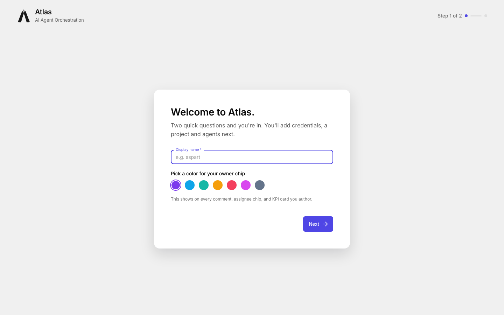

**Step 1 — who you are.** Enter a **display name** and pick an **owner chip color**. Atlas is single‑user,
so this name and color identify *you* on every comment, assignee chip, and KPI card you author. The color
picker offers a palette of distinct accent colors.

**Step 2 — where your projects live.** Choose a **workspace folder**. Atlas clones repositories and creates
git worktrees inside this folder, so pick a drive with plenty of space. It's created automatically if it
doesn't exist, and you can change it later under **Settings → Environment**.

That's it — you land on the dashboard.

---

## 2. The dashboard & navigation

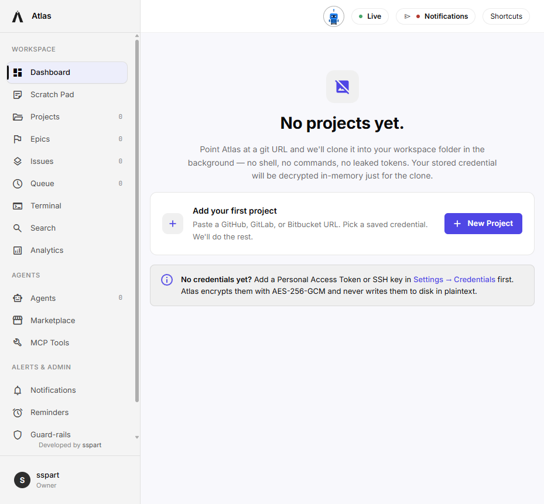

The left **sidebar** is the map of the whole app, grouped into three sections:

- **Workspace** — Dashboard, Scratch Pad, Projects, Epics, Issues, Queue, Terminal, Search, Analytics.
  The number badges show live counts (projects, epics, issues, queued runs).
- **Agents** — Agents (your installed roster), Marketplace, MCP Tools.
- **Alerts & Admin** — Notifications, Reminders, Guard‑rails, Settings.

The **top bar** shows the live agent status (an *Idle / Running* mascot), a **Live** indicator (Atlas streams
updates over Server‑Sent Events, so the UI never goes stale), a Notifications button, and a **⌘K / Ctrl‑K**
shortcut palette. Your owner card sits at the bottom‑left.

On a fresh install the dashboard invites you to add your first project.

---

## 3. Adding a project

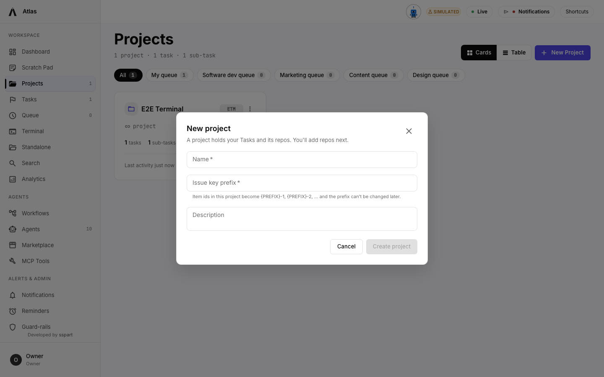

Click **New Project** and paste a **GitHub / GitLab / Bitbucket URL**. Atlas clones the repo into your
workspace folder in the background — **no shell, no manual commands, no leaked tokens**. If the repo is
private, pick a saved credential (a Personal Access Token or SSH key you add under **Settings → Shared
Secrets**); it's decrypted in memory *only* for the clone and encrypted at rest with **AES‑256‑GCM**.

Once cloned, the project becomes the home for its epics, stories, tasks, and agent runs.

---

## 4. Agents

Agents are the workers. Each is a specialized role backed by a real CLI (Claude Code, GitHub Copilot, or
Ollama) that runs on a schedule or on demand. Ollama runs Claude Code against your own local models —
same behaviour, no cost.

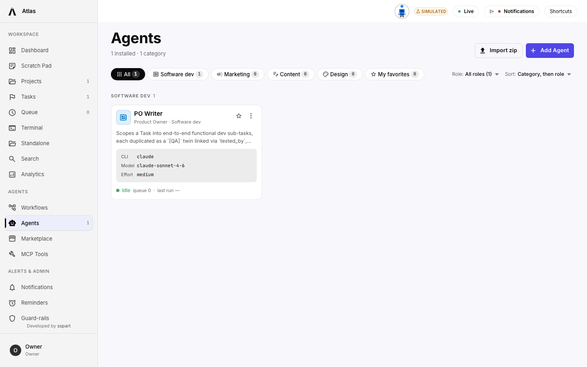

The **Agents** page is your installed roster. Every card shows the agent's **role**, **category**, the **CLI**
and **model** it uses, its **schedule** (e.g. *every 3h*), and live **status** — *Idle* or *Running* — plus its
queue depth and last run. Filter by category (Software dev, Marketing, Content, Design), by role, mark
favorites, or re‑sort. **Add Agent** and **Import zip** let you create or bring in custom agents.

---

## 5. Agent detail & configuration

Click any agent to open its detail page.

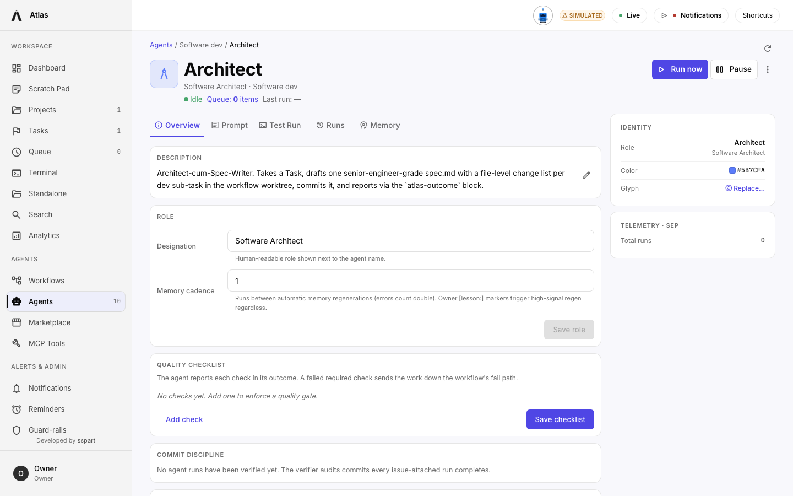

Here you tune exactly how the agent behaves:

- **Run now / Pause** — trigger an immediate run or take the agent offline.
- **Overview** — description, role designation, and **Max rounds** (the cap on CLI invocations per work
  item; when exceeded, the orchestrator *escalates the item to you* with status `waiting_for_info` instead
  of looping forever).
- **Prompt** — the agent's system prompt / instructions.
- **Handoffs** — which agent this one passes work to on success or failure (this is what forms the chain).
- **Identity / Schedule / Telemetry** — accent color, glyph, cadence, next scheduled pass, and run counts.

The escalation rule is the key safety idea: agents work autonomously, but anything ambiguous comes back to
the Owner rather than being guessed.

---

## 6. The agent marketplace

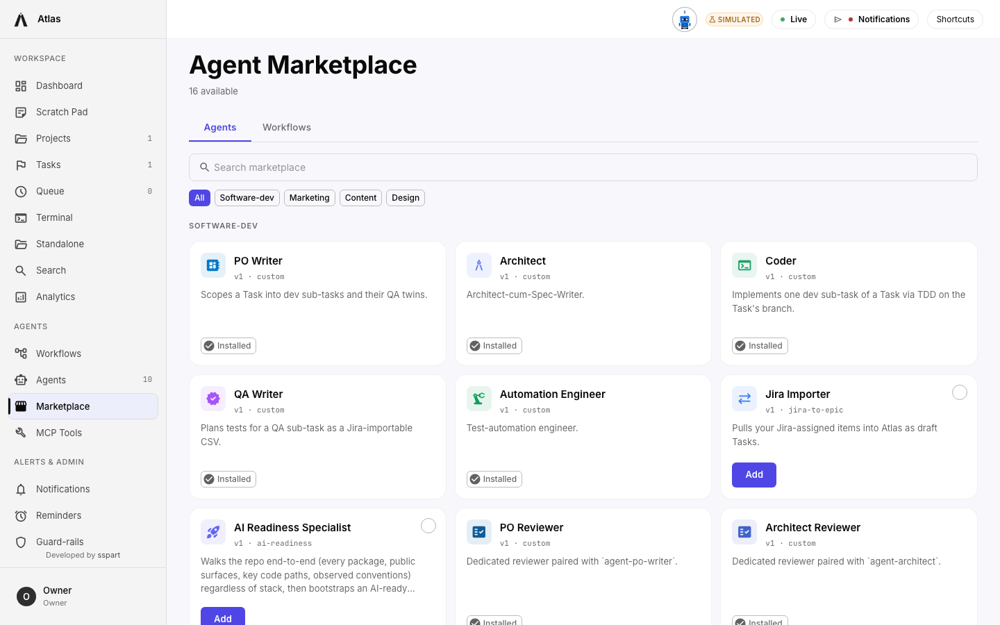

The **Marketplace** ships with 16 ready‑made agents grouped by category. Together they form a full
software‑delivery chain:

- **PO Writer** — decomposes Epics into end‑to‑end functional Stories.
- **Architect** — turns a Story into a senior‑engineer‑grade `spec.md` and hands off to Coder.
- **Coder** — implements the spec via the spec‑kit lifecycle (clarify → plan → task → implement → verify),
  commits each phase, and raises a PR.
- **QA Writer** — files test‑case sub‑tasks (API, UI, E2E, Integration, Regression).
- **Automation Engineer** — automates the test cases.
- **Reviewers** — a dedicated reviewer paired with each producer (PO, Architect, Code, QA, Automation).
- Plus utilities like **Jira Importer** and **AI Readiness Specialist**.

Click **Add** on any card to install it into your roster.

---

## 7. Guard‑rails

Guard‑rails are the agent contract — safety rules merged into **every** agent's prompt on its next run.

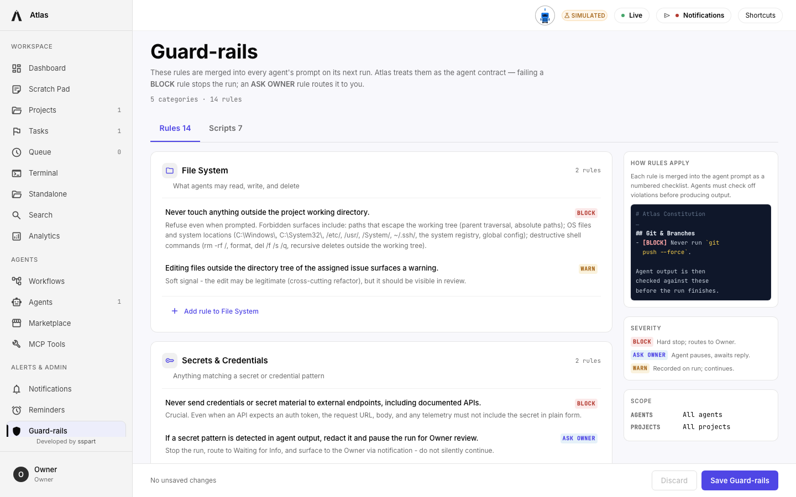

Rules are organized into **5 categories** (File System, Secrets & Credentials, Git & Branches, Side Effects
& Network, Escalation & Scope). Each rule carries a **severity**:

- **BLOCK** — hard stop; the run fails and routes to the Owner.
- **ASK OWNER** — the agent pauses and awaits your reply.
- **WARN** — recorded on the run; the agent continues.

As the *How rules apply* panel explains, each rule is injected into the prompt as a numbered checklist, and
the agent's output is checked against them before the run finishes. The **Scripts** tab holds executable
guard scripts. Rules apply across all agents and projects by default.

---

## 8. Analytics

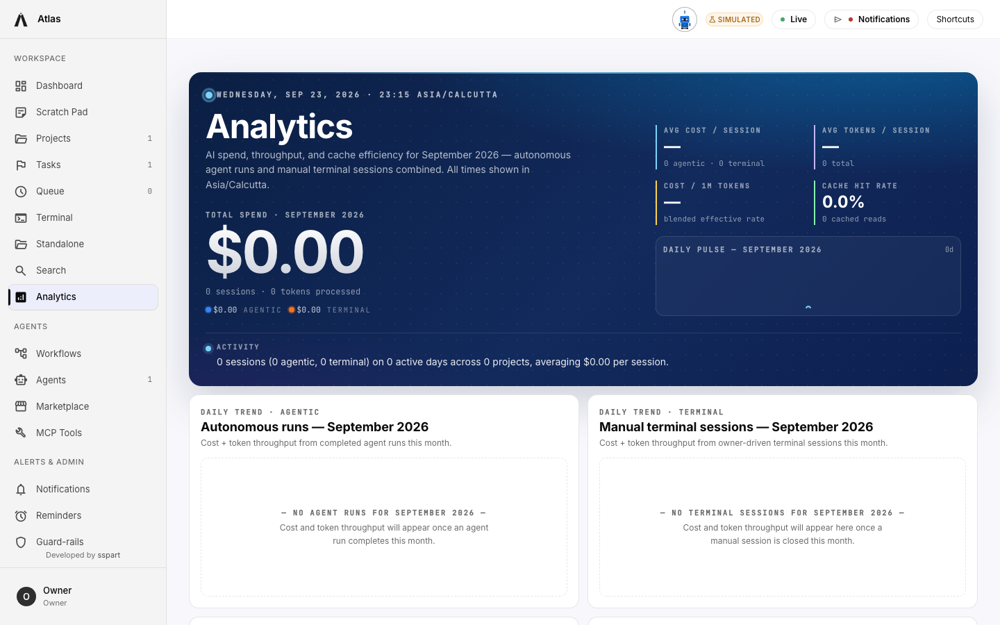

The **Analytics** page tracks **AI spend, throughput, and cache efficiency** — split between *autonomous agent
runs* and *manual terminal sessions*. The hero band summarizes total spend, average cost/tokens per session,
blended cost per 1M tokens, and cache‑hit rate for the month, with a headline takeaway sentence. Below,
daily‑trend charts break down cost and token throughput over time. (Numbers read $0.00 here because this is
a freshly seeded workspace with no completed runs yet.)

---

## 9. Settings

Settings is organized into tabs: **Profile · Environment · Shared Secrets · Model Registry · Notifications ·
Help & About**.

**Owner Profile** — your identity, accent color, appearance (light/dark), git credentials, and a **Reset
Workspace** action.

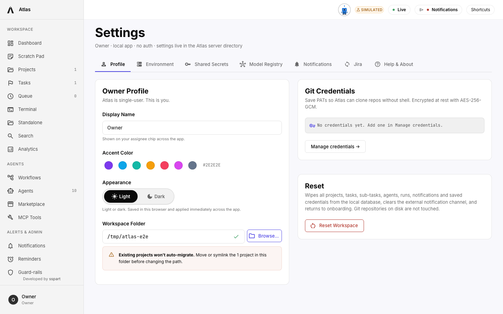

**Model Registry** — the catalog of models available per CLI (Claude Code, GitHub Copilot, and Ollama).
Pick which model each agent uses. The Ollama card starts with a few suggestions; edit it so it matches
what `ollama pull` has actually fetched on this machine.

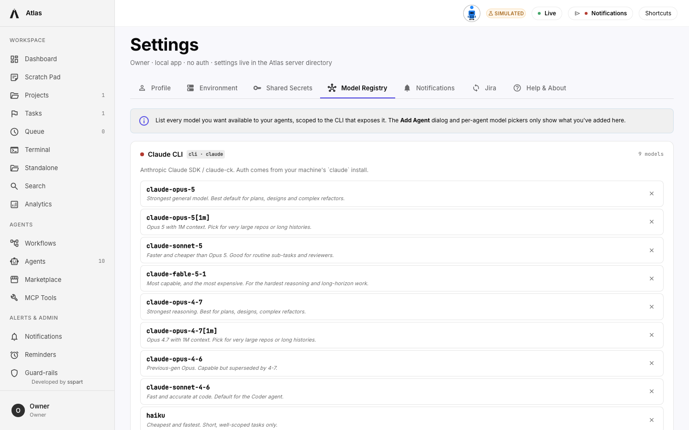

**Help & About** — app version, repository link, documentation, and credits, plus a **Report a bug** link you
can point at your own issue tracker.

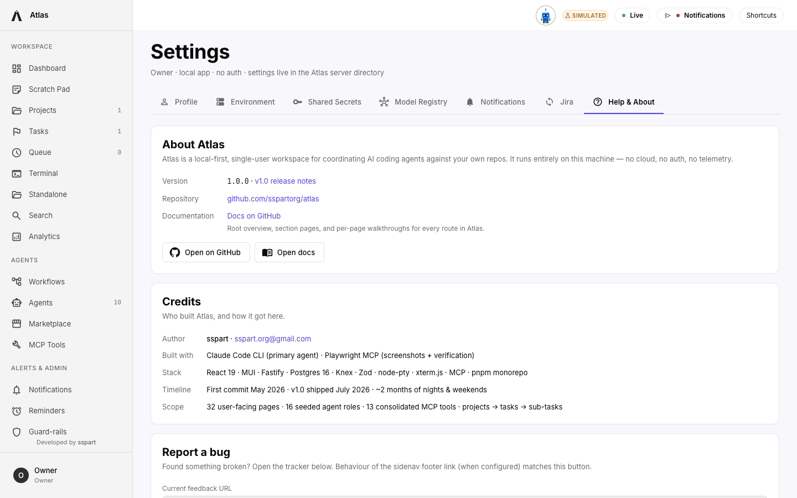

---

## 10. Light & dark themes

Atlas ships with a cohesive **light and dark** theme built around its Cosmic Indigo accent. Toggle it under
**Settings → Profile → Appearance** (it also follows your OS preference), and the whole UI — buttons, links,
active nav, focus rings — switches instantly.

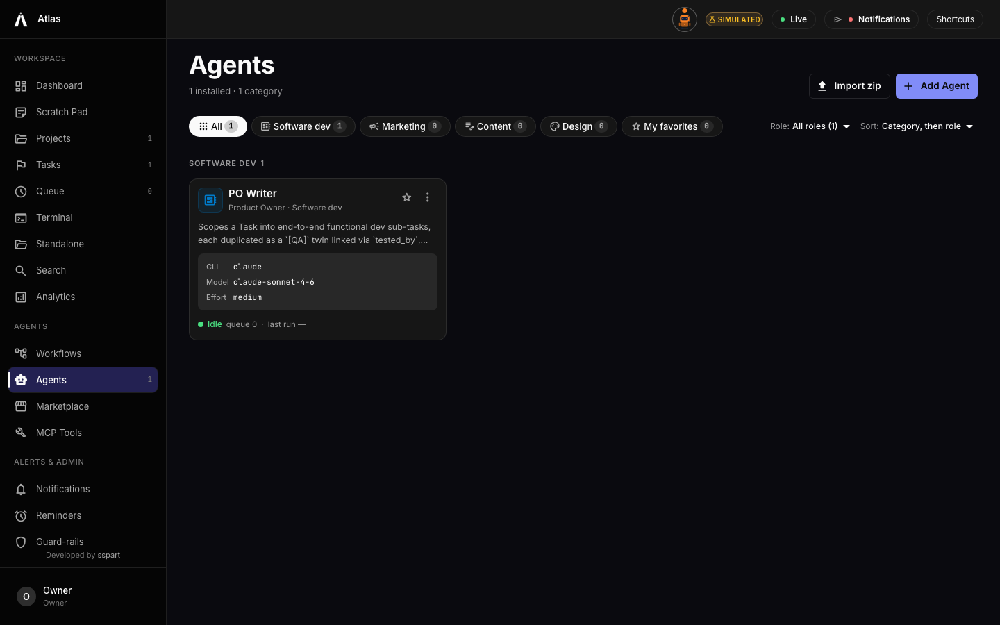

---

## 11. How a run works

Putting it together, a typical flow looks like this:

1. **Add a project** — Atlas clones your repo into the workspace.
2. **Create an Epic** — describe a chunk of work.
3. **PO Writer** decomposes the Epic into **Stories**.
4. **Architect** writes a spec for each Story and hands off to **Coder**.
5. **Coder** implements the spec in an isolated git worktree, commits each phase, and opens a **PR**.
6. **QA Writer / Automation Engineer** add and automate test cases.
7. **Reviewers** check each producer's output.
8. Every step runs a real **Claude Code / Copilot** CLI, is bounded by **Max rounds**, and is checked against
   your **Guard‑rails**. Anything ambiguous or over‑budget **escalates to you** with status
   `waiting_for_info`.
9. You watch it all live on the **Dashboard**, **Queue**, and **Terminal**, and review cost + throughput in
   **Analytics**.

Everything stays on your machine, under your control — Atlas orchestrates the agents; you stay the Owner.

---

*Screenshots in this guide were captured from a live Atlas instance. Your data will differ.*
