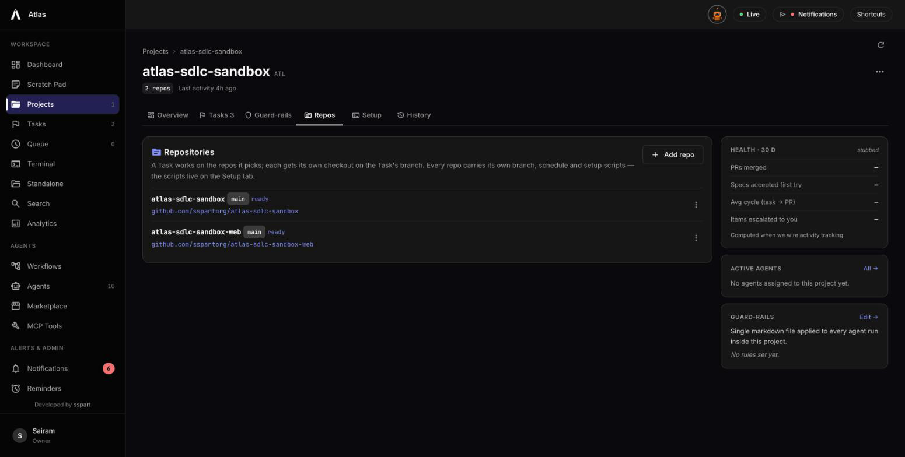
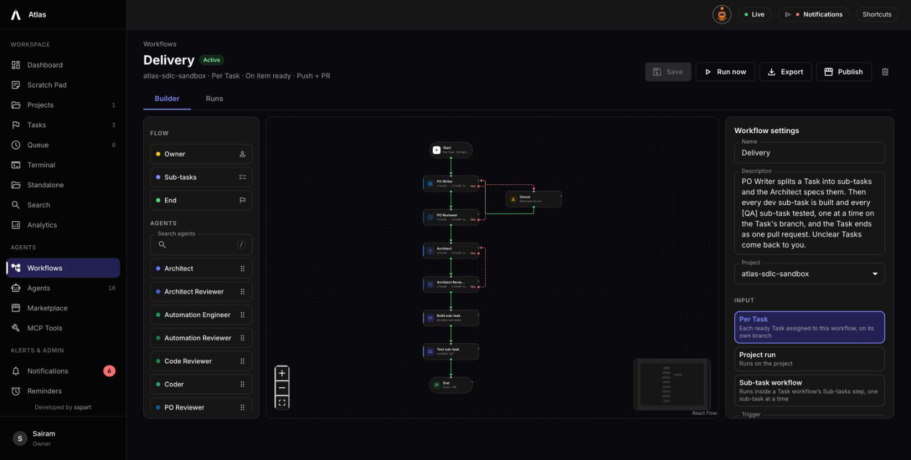
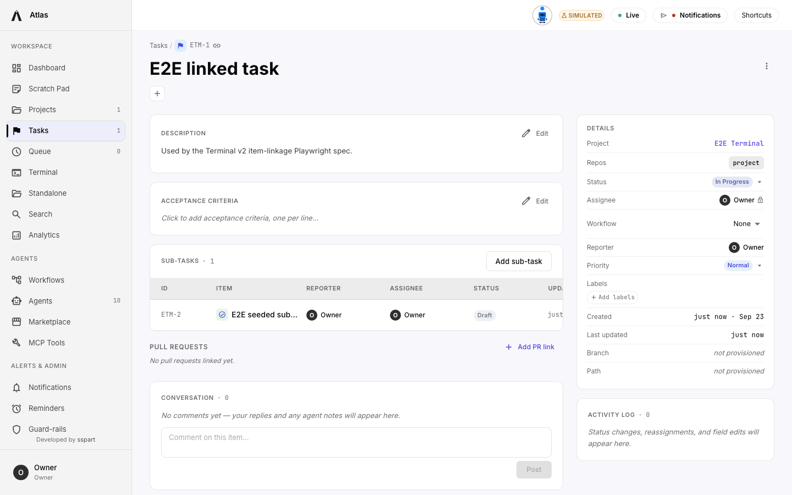

# Atlas — User Guide

**Atlas** is a local-first, single-owner workspace for orchestrating AI coding agents against your own
repositories. It runs entirely on your machine — **no cloud, no auth, no telemetry**. You point Atlas at
one or more git repos, describe work as **Tasks**, and a **workflow** — a graph of specialised agents
(PO writer, architect, coder, reviewers, QA) — picks each Task up, runs a real CLI agent
(**Claude Code** / **GitHub Copilot** / **Ollama**) inside a dedicated git worktree, and opens a pull
request. You stay the Owner: agents never route work, and anything ambiguous comes back to you.

This guide walks the whole app, screen by screen.

---

## Contents

1. [Install and first boot](#1-install-and-first-boot)
2. [Onboarding](#2-onboarding)
3. [Credentials](#3-credentials)
4. [Projects and repos](#4-projects-and-repos)
5. [Setup scripts and secrets](#5-setup-scripts-and-secrets)
6. [Agents and the marketplace](#6-agents-and-the-marketplace)
7. [Workflows](#7-workflows)
8. [Tasks and sub-tasks](#8-tasks-and-sub-tasks)
9. [Worktrees — what Atlas does on disk](#9-worktrees)
10. [Terminals](#10-terminals)
11. [Jira](#11-jira)
12. [Queue, Search, Analytics, Reminders, Scratch Pad](#12-queue-search-analytics-reminders-scratch-pad)
13. [Guard-rails](#13-guard-rails)
14. [Settings reference](#14-settings-reference)
15. [Light and dark themes](#15-light-and-dark-themes)

---

## 1. Install and first boot

Atlas is a pnpm monorepo. From the repo root:

```bash
pnpm install
pnpm doctor     # checks node, pnpm, docker, git, and which agent CLIs you have
pnpm dev
```

`pnpm dev` does four things in order: starts a Postgres container (`atlas-postgres`, image
`pgvector/pgvector:pg16`), waits for it, applies migrations, then launches the API and web app in
parallel.

Defaults are web **:4000**, API **:4001**, Postgres **:5500**, and an MCP listener on **:4500**. If
something else on your machine already holds those ports, change `WEB_PORT` and `API_PORT` in `.env` —
and change `API_PROXY_TARGET` to match the new API port, or the UI will proxy its API calls somewhere
unexpected.

`pnpm doctor` reporting `[skip] copilot: not found (optional)` is normal if you only use Claude Code.
It matters later: agents installed from the marketplace may default to a CLI you do not have.

---

## 2. Onboarding

On first boot every route redirects to `/onboarding` until it is complete.


Two steps: your display name and an accent colour, then a **workspace folder**. That folder is where
Atlas clones every repo and creates every agent worktree — pick somewhere with disk space. Atlas
creates it if it does not exist; the path must be absolute.

Your display name is the only identity Atlas has. There is no users table — every comment, reporter
chip and commit trailer is signed with this string.

---

## 3. Credentials

`Settings → Credentials`. Atlas needs a git credential before it can clone anything.

Two kinds:

- **Personal Access Token** — simplest. Label, host, username, token, optional repo scope.
- **GitHub App** — commits are authored by the App's bot identity, with you as a `Co-Authored-By`
  trailer and `Requested-By: @you` on the PR body. Point Atlas at a folder containing the App's
  `app-config.json` and its `.pem`; Atlas reads the app id and slug from the file and discovers the
  installation itself. There is no field to type an installation id into.

Everything is encrypted at rest with AES-256-GCM under a key at `~/.config/Atlas/workspace.key`
(`%APPDATA%\Atlas\workspace.key` on Windows). Secrets never come back in a list response — the UI
fetches a single value on demand when you click Reveal, and each reveal is logged.

> **Keep that key file.** On macOS it cannot be re-derived. Delete it and every stored credential and
> secret becomes permanently unreadable.

---

## 4. Projects and repos


A **project** groups one or more repos. Create one from `/projects` → **New Project**, either cloning
fresh from a URL or connecting a folder already on disk. You choose an **issue key prefix** (e.g.
`ATL`) — it is frozen at creation and every Task in the project is numbered from it: `ATL-1`, `ATL-2`.



**There is no primary repo.** Every repo is an ordinary row with its own clone, credential, default
branch, auto-fetch schedule and setup scripts. Add more from the project's **Repos** tab. A Task then
picks which repos it changes, and one Task can span several.

Per-repo actions live in the Repos tab row menu: edit the default branch, set an auto-fetch schedule,
re-clone from remote (stashing local work), reveal the folder, or remove the repo. Removing a repo
leaves its folder on disk and strips it from every Task that referenced it; it is refused with a 409
while a workflow run is using it.

**Deleting a project** offers two modes. *Unregister* removes Atlas's rows and leaves every folder
alone. *Purge* additionally deletes the repo folders — but only those strictly inside your workspace
folder. A repo you connected from somewhere else is kept, and Atlas says so.

---

## 5. Setup scripts and secrets

Before any agent runs, Atlas provisions a worktree and runs that repo's **setup script** inside it —
`npm ci`, migrations, whatever the repo needs to be workable.

**Scripts are per repo, not per project.** The project's **Setup** tab has a repo picker above two
editors, one bash and one PowerShell. Atlas runs the one matching the host OS; an empty body means
"nothing needed here". A project with three repos has three independent scripts, run one per repo in
order, once per workflow run.

Scripts are **idempotent** — Atlas runs them on every worktree provision, not once at project creation.

Secrets come in two tiers and are merged, with the project tier winning on a key collision:

- **Settings → Shared Secrets** — available to every project.
- **Project → Manage Secrets** — just this one.

Reference them as `${variable.KEY}`. Atlas substitutes the value before writing the script to disk, so
the shell never sees the placeholder. Ordinary shell expansion (`$HOME`, `${PATH}`) is untouched. An
unknown key is fatal: the run ends as `setup_failed` and no agent CLI is started. Script output is
redacted — any secret value of four characters or more is replaced with `***` before it is stored.

> **Anything your script leaves in the worktree root gets committed.** Atlas runs `git add -A` before
> pushing. Write scratch files to `$TMPDIR`, or add them to the repo's own `.gitignore`.

---

## 6. Agents and the marketplace


Atlas ships **no agents**. A fresh install has zero; you install them from
`Agents → Marketplace`, which carries a catalog of sixteen covering software delivery, marketing,
content and design.


Each agent is a CLI (`claude`, `copilot`, `ollama`), a model, an effort level and a prompt.

> **Check the CLI.** Marketplace agents carry a default CLI, and installing a workflow template installs
> whatever agents it references. If an agent is set to a CLI you do not have installed, its run fails
> when it reaches that step. Change it on the agent's Overview tab.


Agent Detail has five tabs: **Overview** (role, CLI, model, effort, quality checklist), **Prompt**
(edit with version history and revert), **Test Run** (a dry run that streams output without touching a
repo), **Runs** (history), and **Memory** (procedural memory the agent accumulates).

An agent's **checklist** matters more than it looks: a workflow step routes on it. An agent that
reports `done` with a required checklist row unsatisfied takes the failure edge instead.

---

## 7. Workflows

A **workflow** is a graph that decides what happens to a Task. Agents never route work — the graph
does.

Create one from `/workflows` → **New workflow**, blank or from a starter template. The `delivery`
template is the full software chain and pulls in its `build` and `test` sub-workflows.



The builder canvas takes node types: **agent** nodes, an **Owner** node (park and wait for you), a
**Sub-tasks** node (run each of the Task's sub-tasks through a sub-workflow), and **End**. Edges are
**pass** or **fail**, so a reviewer rejecting work sends it back rather than forward.

The Start inspector sets the trigger:

- **manual** — you press Run.
- **item_ready** — any Task queued on this workflow starts automatically once it reaches `ready`.
- **schedule** — cron.

and the delivery behaviour: whether to use a worktree, whether to push, and whether to open a PR.

---

## 8. Tasks and sub-tasks

There are two item kinds: a **Task** and its **Sub-tasks**. No epics, no stories, no bugs.

Create one at `/tasks/new`: title, description, project, and **which repos it changes**. Creating a
Task provisions nothing — no branch, no worktree. That happens when a workflow run starts.

Assign a workflow from the Task's right rail. A Task with no workflow sits waiting for you; Atlas will
not guess one.

Then the chain runs: the PO writer splits the Task into sub-tasks, the architect specs them, and each
sub-task is built and tested one at a time **on the Task's branch**. A `[QA]` suffix marks the sub-tasks
the test sub-workflow picks up.



**One Task = one branch = one pull request per repo it changed.** A Task spanning two repos produces two
PRs from the same branch name, cross-linked to each other.

Status moves through `draft → ready → in_progress → in_review → done`, with `waiting_for_info` as the
escape hatch whenever an agent needs you. The status picker only offers legal moves; anything else sits
under a separate **Override** heading and is recorded as an override.

While a workflow run holds a Task, status and assignee changes are refused with a 409. Stop the run to
take it back.

---

## 9. Worktrees

Atlas never runs an agent in your clone. Each run gets a git worktree:

- **One repo** → `<workspace>/worktrees/<repoId>/<branch>/`
- **Several repos** → `<workspace>/worktrees/<projectId>/ws/<branch>/`, containing one checkout per
  repo side by side

The multi-repo workspace root is **not itself a git repo**. Agents commit inside each checkout.

⚠️ That shared parent folder is temporary — it is deleted at teardown. Do not write code that reaches
across it by relative path (`../other-repo/...`): it resolves during the run and nowhere else, so a test
written that way passes once and fails in CI, in a fresh clone, and after merge.

On success Atlas commits, pushes, opens the PR, then removes the worktree and deletes the local branch.
If delivery fails, or the workflow does not push, **the worktree is deliberately left in place** so a
resumed run picks up exactly where it stopped.

---

## 10. Terminals

Three flavours:

- **`/terminal`** — a session attached to a project repo. Atlas provisions a worktree, stages its
  scaffolding, runs the setup script, then hands you a live CLI. Stopping lets you choose files to
  stage, writes a commit, pushes, and optionally opens a PR.
- **`/terminal/layout`** — the same sessions in a multi-pane grid.
- **`/terminal/standalone`** — a CLI in **any folder on your machine**, with no worktree, no branch and
  nothing written into the folder. Stopping it commits nothing, pushes nothing and deletes nothing.

Pausing a session kills the process but keeps the worktree; resuming re-stages Atlas's scaffolding but
does **not** re-run the setup script.

Closed sessions keep a readable transcript at `/terminal/:id/history`.

---

## 11. Jira

`Settings → Jira`. The bridge is plain code on a timer — no AI, no tokens spent.

Configure a site URL, an email and an API token, then one or more **sources**. Each source is a repo, a
JQL query, and optionally a workflow. Every poll runs each JQL; new issues become Tasks in that repo's
project, and a source carrying a workflow queues the Task on it automatically. Without one the Task
waits for you.

Progress flows back as comments — queued, in progress, waiting on you, ready for review with the PR,
done — and a Task reaching Done transitions the Jira issue.

> **Trust boundary.** Anyone who can edit an issue matching your JQL is writing text that becomes an
> agent's prompt. Atlas quotes imported text line by line under a note saying it describes the work and
> is not an instruction — but keep your JQL scoped to issues your team controls, and leave a source's
> workflow empty if you want to review each Task first.

Plain `http` is refused for the site URL except on loopback, because the bridge sends Basic-auth
credentials to that origin.

---

## 12. Queue, Search, Analytics, Reminders, Scratch Pad

**Queue** shows what each workflow is running, what is waiting on you, and which ready Tasks have no
workflow yet.

**Search** (`Ctrl/Cmd+K`) covers Tasks and sub-tasks with filters for project, type, status, assignee
and labels.


**Analytics** reports agent runs and terminal sessions — cost, tokens, cache efficiency — and drills
from workspace to project to Task. Cost is computed for Claude sessions; Copilot sessions report none.

**Reminders** are one-off or recurring nudges, delivered in-app, to your external channel, or both.

**Scratch Pad** is free-form markdown tiles that autosave, for thoughts not yet shaped into a Task.

---

## 13. Guard-rails


**Rules** are prose every agent must respect, with a severity of `block`, `ask_owner` or `warn`.
Workspace rules apply everywhere; a project can add its own.

**Scripts** are executable checks staged into every worktree at `.atlas/scripts/`. Agents run them and
report the result — Atlas does not run them for you. This is how a workflow enforces things like "the
test suite is green" or "the commit message follows Conventional Commits".

---

## 14. Settings reference


- **Profile** — display name, accent colour, workspace folder, and **Reset workspace**, which truncates
  projects, Tasks, agents, runs, notifications and credentials, and returns you to onboarding. It does
  **not** touch anything on disk.
- **Environment** — the API's own `.env` values.
- **Shared Secrets** — global `${variable.KEY}` values.


- **Model Registry** — which `(cli, model)` pairs agents may use. An agent can only be saved with a
  pair listed here.
- **Notifications** — Telegram or Microsoft Teams, per-event toggles, quiet hours, browser push, and
  the terminal-idle threshold.
- **Jira** — see above.


- **Help & About** — version, stack and credits.

---

## 15. Light and dark themes

Atlas follows your system theme and can be pinned from `Settings → Profile`.


---

## Appendix — running Atlas safely

- **`ATLAS_MCP_TOKEN` is generated for you.** If it is empty when the API boots, Atlas mints a
  48-byte random token, writes it to your `.env`, and logs that the write gate is closed. You do not
  need to set it by hand. The browser UI never sends it — it is admitted by `Sec-Fetch-Site`, a
  header no non-browser client can forge — so the token only matters to the MCP shim and to any
  script you write against the API. Setting `ATLAS_MCP_TOKEN_OPEN=1` disables the gate entirely;
  only the test suites should do that.
- `ATLAS_LAN_ACCESS` is `false` by default, and the MCP listener binds loopback only. Changing either
  widens what can reach the API.
- Atlas is single-owner by design. There are no accounts, roles or audit trails beyond the activity log.
