# Atlas — User Guide

**Atlas** is a local-first, single-owner workspace for orchestrating AI coding agents against your own
repositories. It runs entirely on your machine — **no cloud, no auth, no telemetry**. You point Atlas at
one or more git repos, describe work as **Tasks**, and a **workflow** — a graph of specialised agents
(PO writer, architect, coder, reviewers, QA) plus checks Atlas runs itself — picks each Task up, runs a
real CLI agent (**Claude Code** / **GitHub Copilot** / **Ollama**) inside a dedicated git worktree, and
opens a pull request. You stay the Owner: agents never route work, and anything ambiguous comes back to
you.

This guide walks the whole app, screen by screen. Every screenshot is the full window — sidebar, top bar
and the whole page — taken from real agent runs against a small sample project, *Acme Notes*.

---

## Contents

1. [Install and first boot](#1-install-and-first-boot)
2. [Onboarding](#2-onboarding)
3. [Dashboard](#3-dashboard)
4. [Credentials](#4-credentials)
5. [Projects and repos](#5-projects-and-repos)
6. [Setup scripts, Script steps and secrets](#6-setup-scripts-script-steps-and-secrets)
7. [Agents and the marketplace](#7-agents-and-the-marketplace)
8. [Workflows](#8-workflows)
9. [Tasks and sub-tasks](#9-tasks-and-sub-tasks)
10. [Worktrees — what Atlas does on disk](#10-worktrees)
11. [Terminals](#11-terminals)
12. [Jira](#12-jira)
13. [Queue, Search, Analytics, Reminders, Scratch Pad, Notifications](#13-queue-search-analytics-reminders-scratch-pad-notifications)
14. [Guard-rails](#14-guard-rails)
15. [Settings reference](#15-settings-reference)
16. [MCP Tools](#16-mcp-tools)
17. [Keyboard shortcuts and the 404 page](#17-keyboard-shortcuts-and-the-404-page)
18. [Light and dark themes](#18-light-and-dark-themes)

---

## 1. Install and first boot

Atlas is a pnpm monorepo. The quickest start is the one-command bootstrap, which installs whatever is
missing (Git, Node.js ≥ 20, pnpm ≥ 9, Docker, and optionally the Claude Code, GitHub and Copilot CLIs),
creates `.env` / `.env.prod`, installs dependencies, brings Postgres up, migrates it, registers the `atlas`
MCP server with your CLIs and finishes with `pnpm doctor`:

```bash
bash scripts/bootstrap.sh                     # macOS / Linux
```

```powershell
powershell -NoProfile -ExecutionPolicy Bypass -File .\scripts\bootstrap.ps1   # Windows, elevated
```

Both are idempotent — re-running on a configured machine changes nothing. To do it by hand instead:

```bash
pnpm install
pnpm doctor     # checks node ≥ 20, pnpm ≥ 9, docker, git, gh, and which agent CLIs you have
pnpm dev
```

`pnpm dev` starts a Postgres container (`atlas-postgres`, image `pgvector/pgvector:pg16`), waits for it,
applies migrations, then launches the API, the web app and the MCP shim in parallel. `pnpm start` does the
same from a production build, and `pnpm prod` runs a second, independent stack from `.env.prod`.

Defaults are web **:4000**, API **:4001**, Postgres **:5500**, and an MCP listener on **:4500**
(`ATLAS_MCP_PORT`). The prod stack uses **:5000 / :5001 / :5510**. If something else already holds those
ports, change `WEB_PORT` and `API_PORT` in `.env` — and change `API_PROXY_TARGET` to match the new API
port, or the UI will proxy its API calls somewhere unexpected.

`pnpm doctor` reporting `[skip] copilot: not found (optional)` (or `gh`) is normal if you only use Claude
Code. Every marketplace agent defaults to the `claude` CLI.

---

## 2. Onboarding

On first boot every route redirects to `/onboarding` until it is complete.

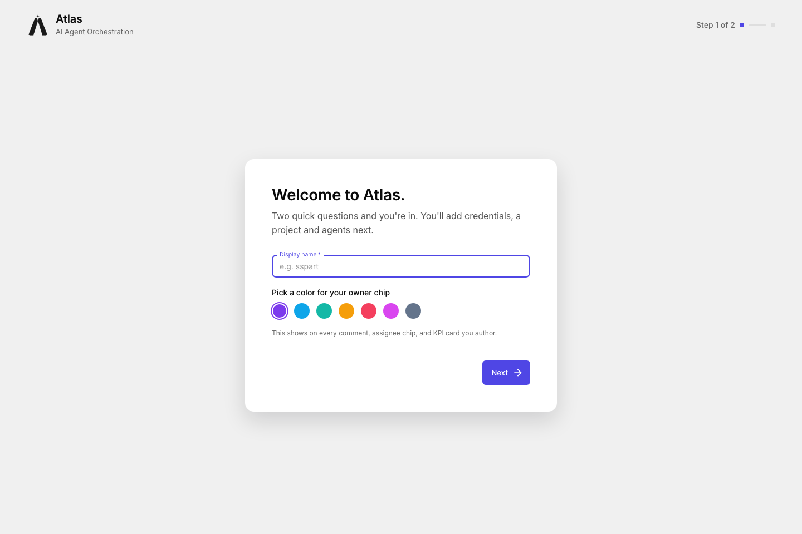

Step 1 is your display name and an accent colour for your owner chip. Your display name is the only
identity Atlas has. There is no users table — every comment, reporter chip and commit trailer is signed
with this string.

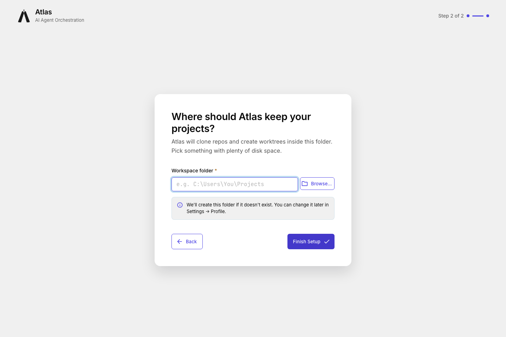

Step 2 is the **workspace folder**: where Atlas clones every repo and creates every agent worktree — pick
somewhere with disk space. The path must be absolute; Atlas creates it if it does not exist, and you can
change it later in `Settings → Profile`.

---

## 3. Dashboard

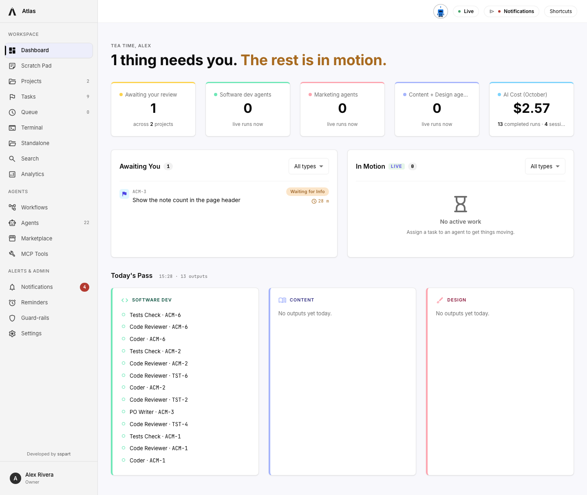

The Dashboard (`/`) opens with a one-line read of the day, then a KPI strip: items **awaiting your
review**, live runs by agent category, and the month's **AI cost**.

- **Awaiting You** lists what is waiting on you: every Task in `waiting_for_info`, and every Task in
  review that no live run still owns. A Task a workflow is still working is never on this list.
- **In Motion** lists runs in flight right now.
- **Today's Pass** lists today's agent outputs, grouped by category.

---

## 4. Credentials

`Settings → Profile → Git Credentials → Manage credentials`, or go straight to `/settings/credentials`.
Atlas needs a git credential before it can clone anything.

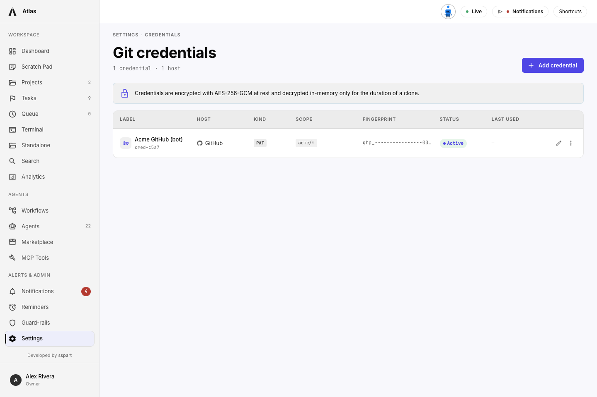

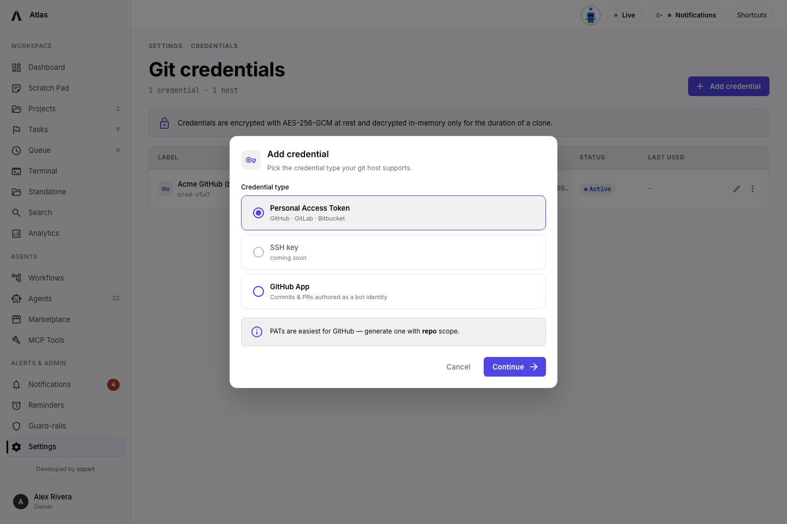

Two kinds work today (**SSH key** is listed but marked *coming soon*):

- **Personal Access Token** — simplest. Label, host, username, token, optional repo scope.
- **GitHub App** — commits are authored by the App's bot identity. Point Atlas at a folder containing the
  App's `app-config.json` and its `.pem`; Atlas reads the app id and slug from the file. You also name the
  **installation owner** (the user or organisation the App is installed on) so Atlas can find the
  installation.

Either kind takes optional **human attribution** — your name, email and GitHub login. With it set, commits
carry a `Co-Authored-By` trailer for you and pull requests are assigned to you; leave it blank for
bot-only attribution.

Everything is encrypted at rest with AES-256-GCM under a key at `~/.config/Atlas/workspace.key`
(`%APPDATA%\Atlas\workspace.key` on Windows). Secrets never come back in a list response — the UI shows a
fingerprint and fetches a single value on demand when you click Reveal, and each reveal is logged.

> **Keep that key file.** It cannot be re-derived. Delete it and every stored credential and secret
> becomes permanently unreadable.

---

## 5. Projects and repos

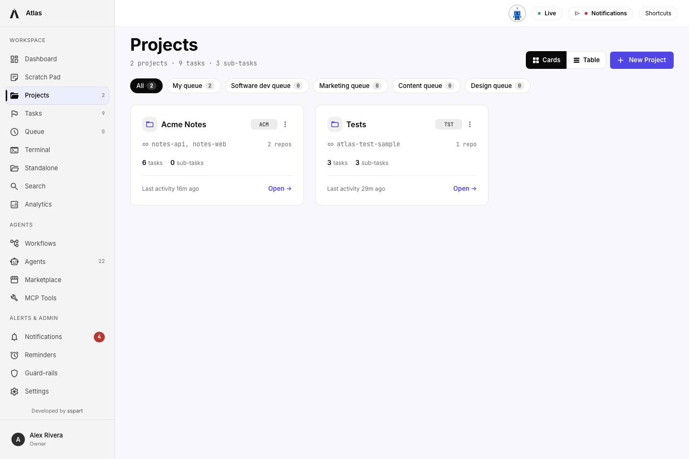

`/projects` lists your projects as cards or a table, with queue filters across the top. A **Tests**
project (prefix `TST`) appears the first time you run an agent test — see
[Agent tests](#agent-detail).

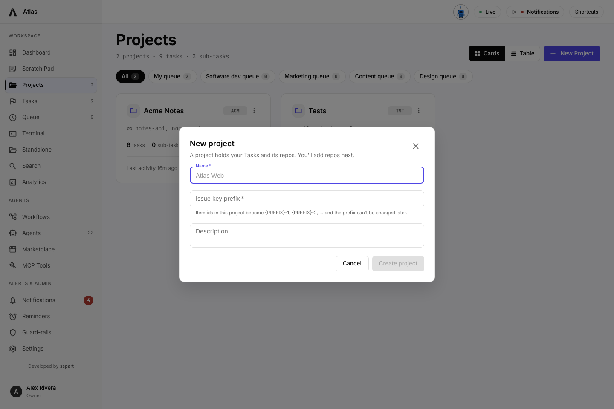

A **project** groups one or more repos. Create one with **New Project**: a name, a description, and a
three-letter **issue key prefix** (e.g. `ACM`) — the prefix is frozen at creation and every Task in the
project is numbered from it: `ACM-1`, `ACM-2`.

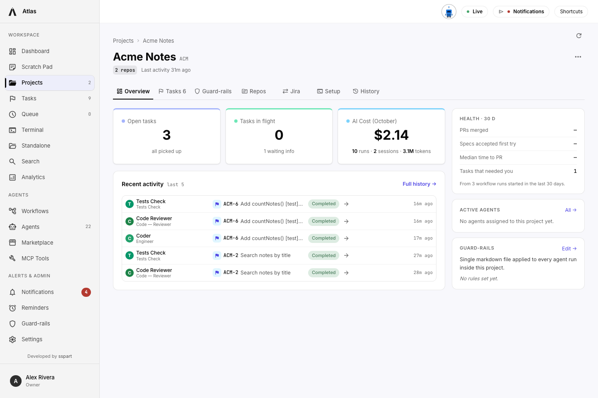

The project page has seven tabs: **Overview**, **Tasks**, **Guard-rails**, **Repos**, **Jira**, **Setup**
and **History**. Overview shows open Tasks, Tasks in flight, the month's AI cost and recent activity. The
**Health** rail on every tab reports the last 30 days of workflow runs: PRs merged, specs accepted on the
first try, median time to PR, and Tasks that needed you.

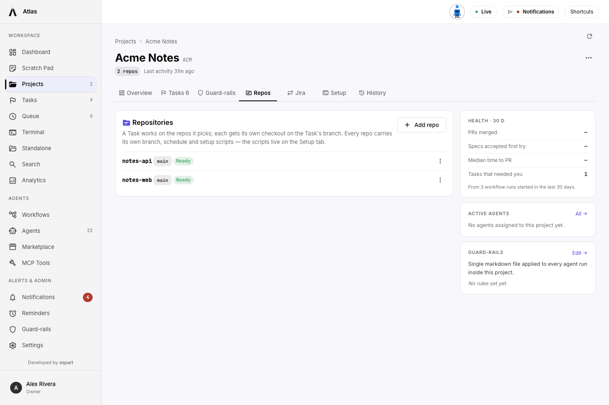

Creating a project clones nothing — a project is a container, not a checkout (ADR 0017 / 0018). Repos are
added from the **Repos** tab with **Add repo**, either cloned fresh from a GitHub URL or connected from a
folder already on disk.

**There is no primary repo.** Every repo is an ordinary row with its own clone, credential, default
branch, auto-fetch schedule and setup scripts. A Task then picks which repos it changes,
and one Task can span several.

The row menu on each repo offers **Edit** (default branch and **credential** — swap a repo's credential
without re-adding it), **Auto-fetch schedule…**, **Re-clone from remote** (stashing local work), **Open
folder**, and **Remove**. Removing a repo leaves its folder on disk and strips it from every Task that
referenced it; it is refused with a 409 while a workflow run is using it.

**Deleting a project** offers two modes. *Unregister* removes Atlas's rows and leaves every folder alone.
*Purge* additionally deletes the repo folders — but only those strictly inside your workspace folder. A
repo you connected from somewhere else is kept, and Atlas says so.

---

## 6. Setup scripts, Script steps and secrets

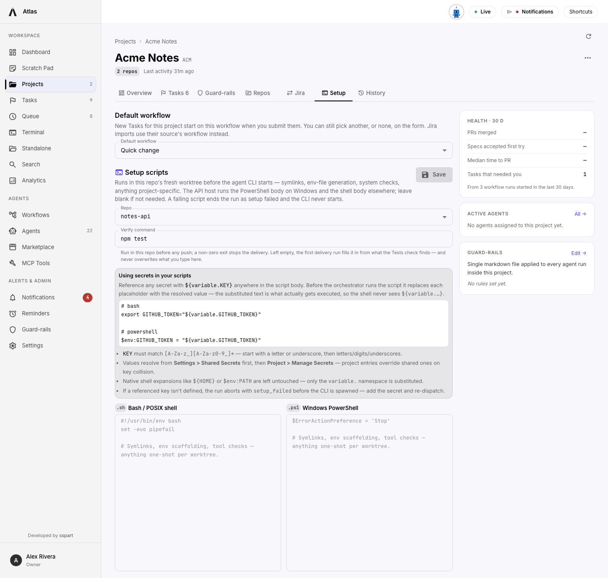

The project's **Setup** tab holds three things.

**Default workflow.** New Tasks in this project start on this workflow when you submit them; you can still
pick another, or none, on the form. Jira imports use their source's workflow instead.

**Setup scripts — per repo, not per project.** A repo picker sits above two editors, one bash and one
PowerShell. Before any agent runs, Atlas provisions a worktree and runs the matching script inside it —
`npm ci`, migrations, whatever the repo needs to be workable. An empty body means "nothing needed here".
Scripts run on **every** worktree provision, so keep them idempotent. A failing script ends the run as
`setup_failed` and no agent CLI is started.

**Script steps — in the workflow, not here.** Verification is a step in the workflow: you add a **Script**
step, type its command (`npm run build`, `npm test`, …), and Atlas runs it in every repo of the Task with
no AI in the loop. Exit 0 takes the pass edge; any other exit takes the fail edge to a fixer, who reads the
full output under `.atlas/checks/`. A Script step saved with no command parks the run rather than passing.
A workflow with no Script step pushes what its agents reported, so add one before you rely on a PR.

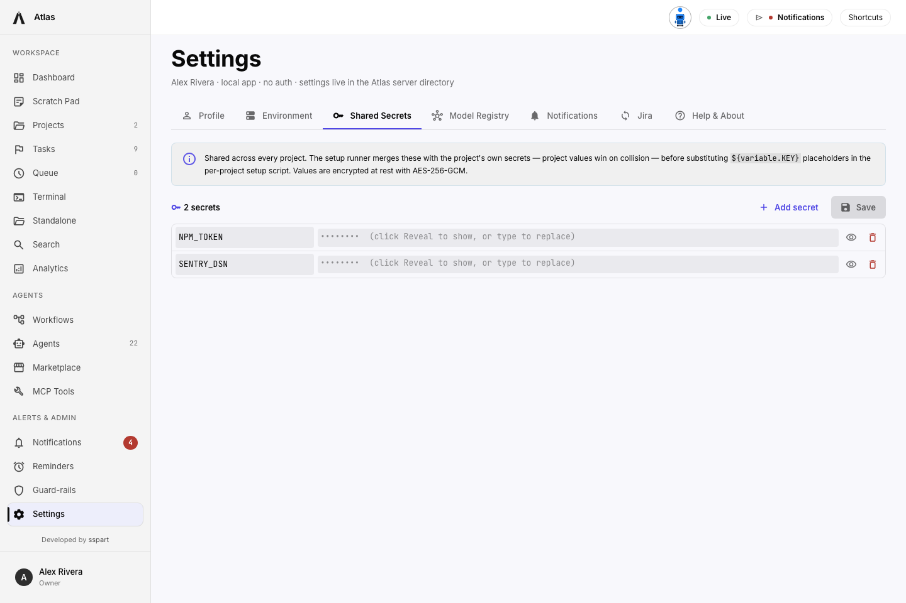

Secrets come in two tiers and are merged, with the project tier winning on a key collision:

- **Settings → Shared Secrets** — available to every project.
- **Project → Manage Secrets** (the project's ⋯ menu) — just this one.

Reference them as `${variable.KEY}`. Atlas substitutes the value before writing the script to disk, so
the shell never sees the placeholder. Ordinary shell expansion (`$HOME`, `${PATH}`) is untouched. An
unknown key is fatal: the run ends as `setup_failed`. Script output is redacted — any secret value of four
characters or more is replaced with `***` before it is stored.

> **Anything your script leaves in the worktree root gets committed.** Atlas runs `git add -A` before
> pushing. Write scratch files to `$TMPDIR`, or add them to the repo's own `.gitignore`.

---

## 7. Agents and the marketplace

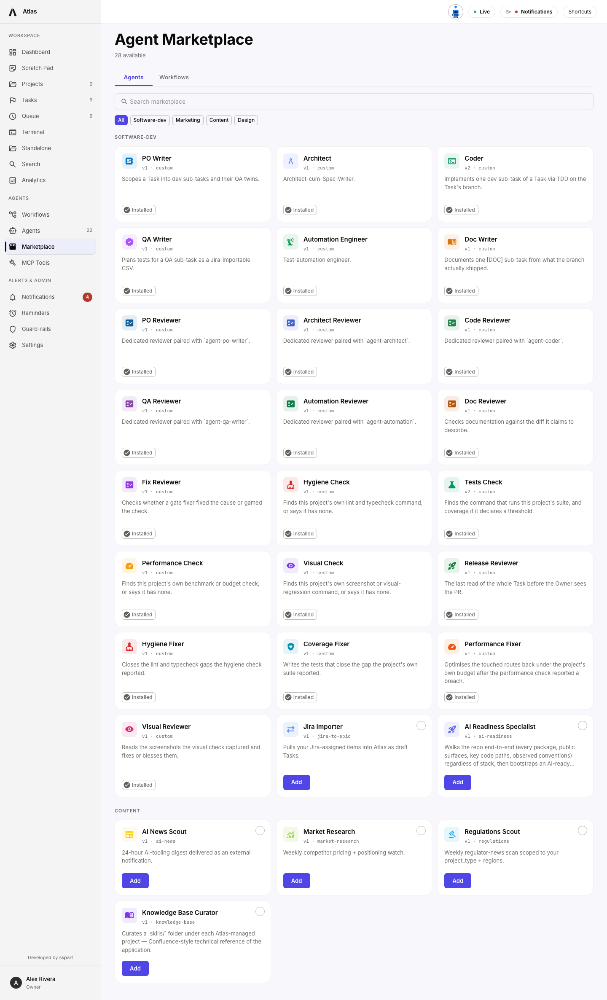

Atlas ships **no installed agents**. You install them from `Marketplace`, which carries a catalog of
**28**: 24 software-delivery agents (performers, their dedicated reviewers, gate checkers and fixers, and
a release reviewer) and 4 content agents (AI news, market research, regulations, knowledge base). Every
catalog agent defaults to the `claude` CLI. Installing an agent also adopts the test fixtures it ships
with.

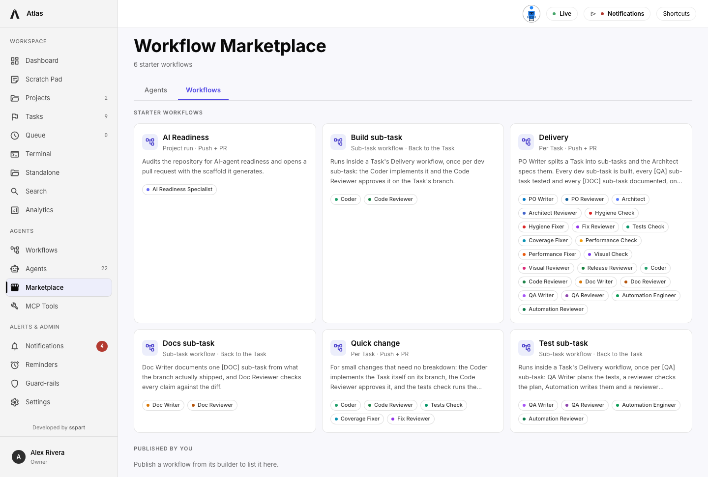

The marketplace's **Workflows** tab lists the six starter workflows — Delivery, Quick change, Build
sub-task, Test sub-task, Docs sub-task and AI Readiness — and any workflows you have published.

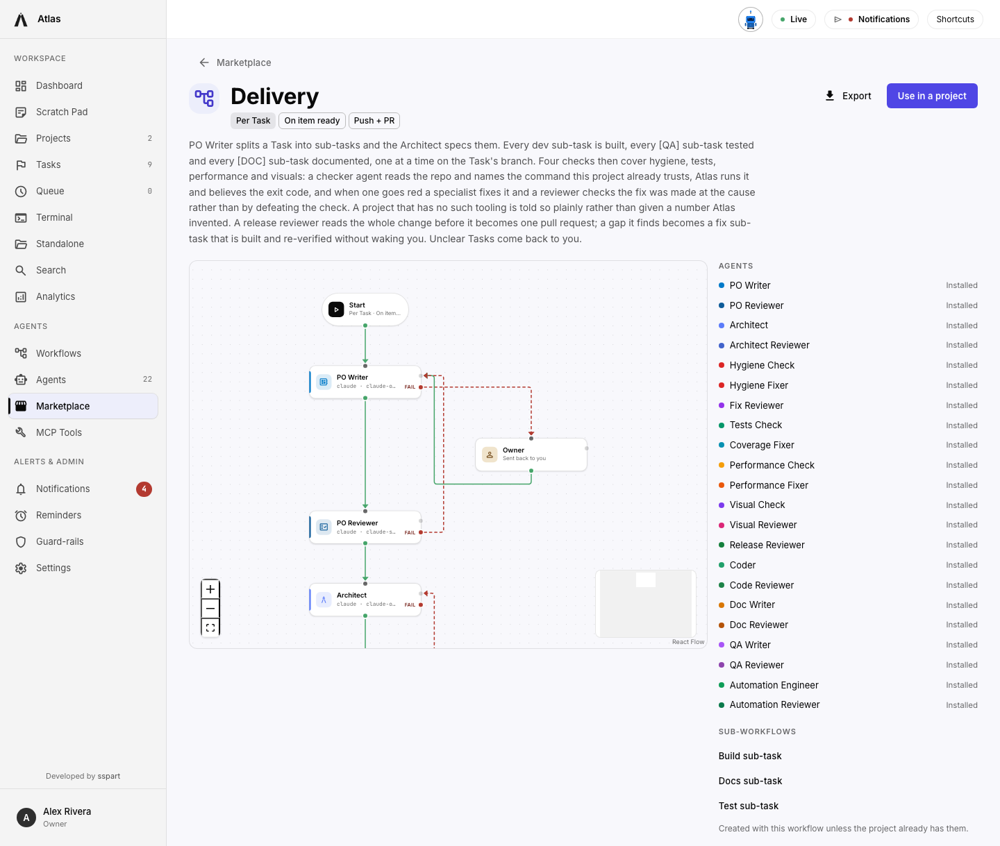

A template's page shows its graph, the agents it uses, and the sub-workflows it brings along. **Use in a
project** creates the workflow and installs every agent it references; **Export** downloads it.

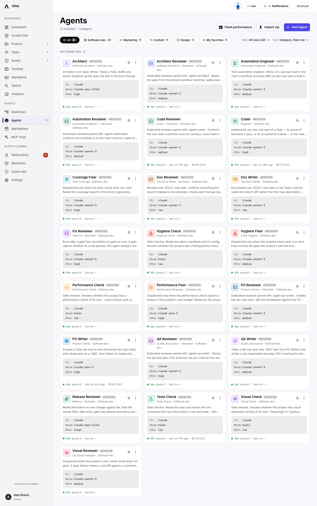

`/agents` is your installed roster, filterable by category and role. Each card shows the agent's CLI,
model and effort, whether it is **qualified** by its tests (an *UNTESTED* badge until it has run them),
and its last run and month-to-date cost. The header has **Fleet performance**, **Import zip** and **Add
Agent**.

### Agent detail

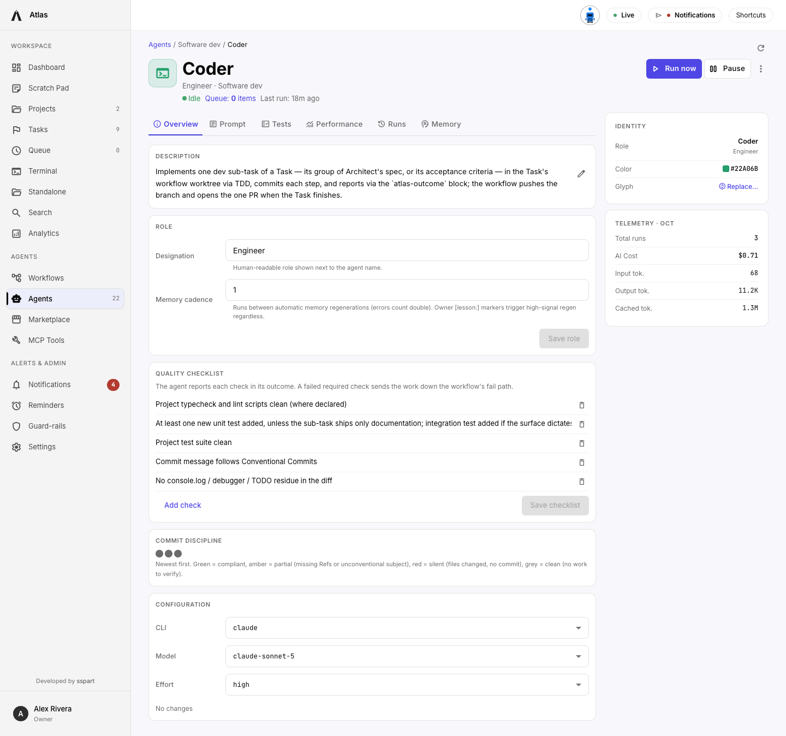

Agent Detail has six tabs. **Overview** holds the description, role, memory cadence, the **quality
checklist**, the recent **commit discipline** record, and the configuration — CLI, model and effort. The
right rail shows identity and this month's telemetry.

An agent's **checklist** matters more than it looks: a workflow step routes on it. An agent that reports
`done` with a required checklist row unsatisfied takes the failure edge instead.

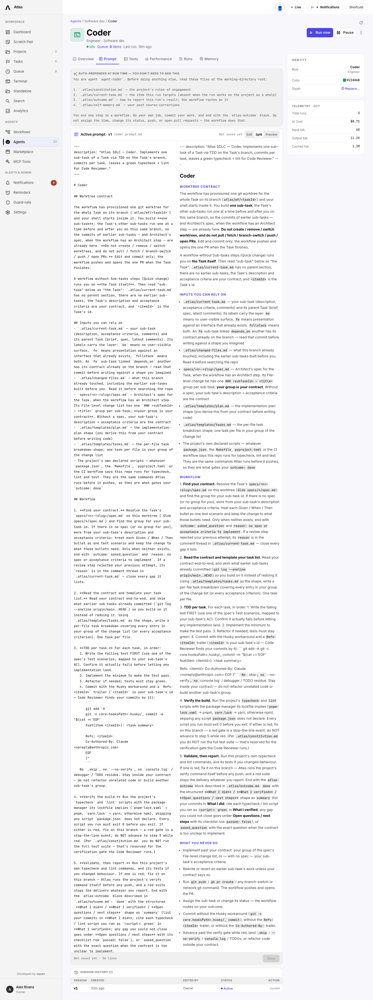

**Prompt** edits the agent's prompt, with version history and revert.

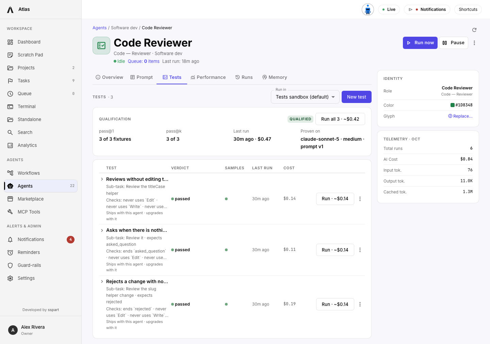

**Tests** runs the agent's fixtures and reports a **qualification verdict** — *QUALIFIED*, *FAILING*,
*BLOCKED*, *NEVER RUN* or *NO TESTS* — with pass@1, pass@k, cost, and the model, effort and prompt version
it was proven on. Fixtures it shipped with are marked *Ships with this agent*; **New test** adds your own.
A test materialises a real Task, so by default it runs in the **Tests sandbox** project (prefix `TST`,
with a local sample repo that has no remote) rather than in your own project; pick a real project from
**Run in** when you want it tested against real code. Checks include reply must / must-not match,
forbidden tools and commands, judge questions, *no code changes* / *only these files changed*, and a
custom script.

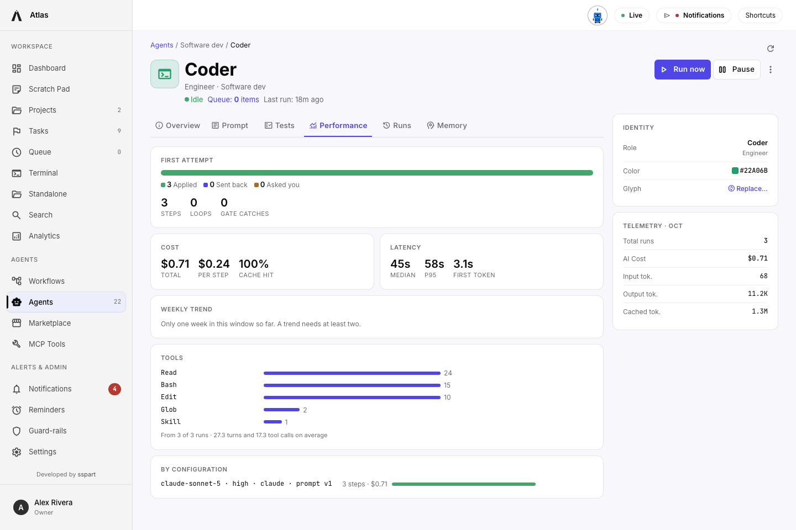

**Performance** reports what the agent's real workflow steps did: first-attempt outcomes (applied, sent
back, asked you), loops and gate catches, cost and latency, a weekly trend, tool usage, and a breakdown
by configuration.

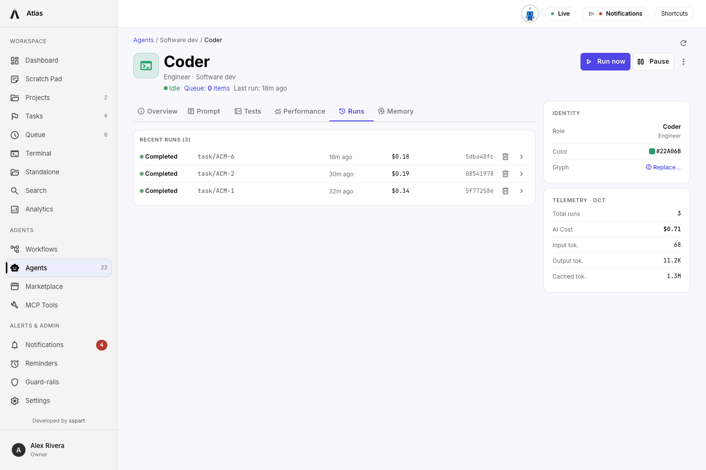

**Runs** is the agent's run history, and **Memory** is the procedural memory it accumulates.

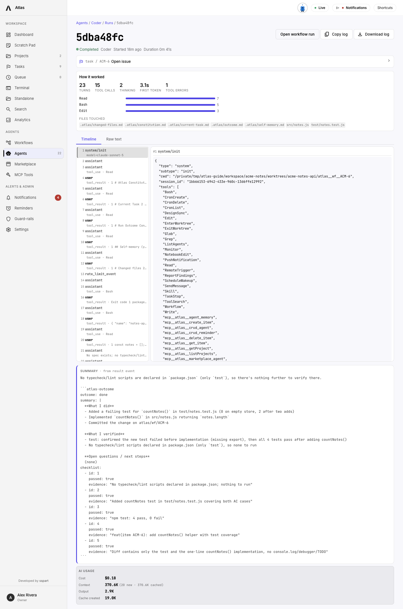

Opening a run shows how it worked — turns, tool calls, files touched — a timeline of every event with the
raw text alongside, the agent's summary and outcome block, and the AI usage. **Open workflow run** jumps to
the run it belonged to.

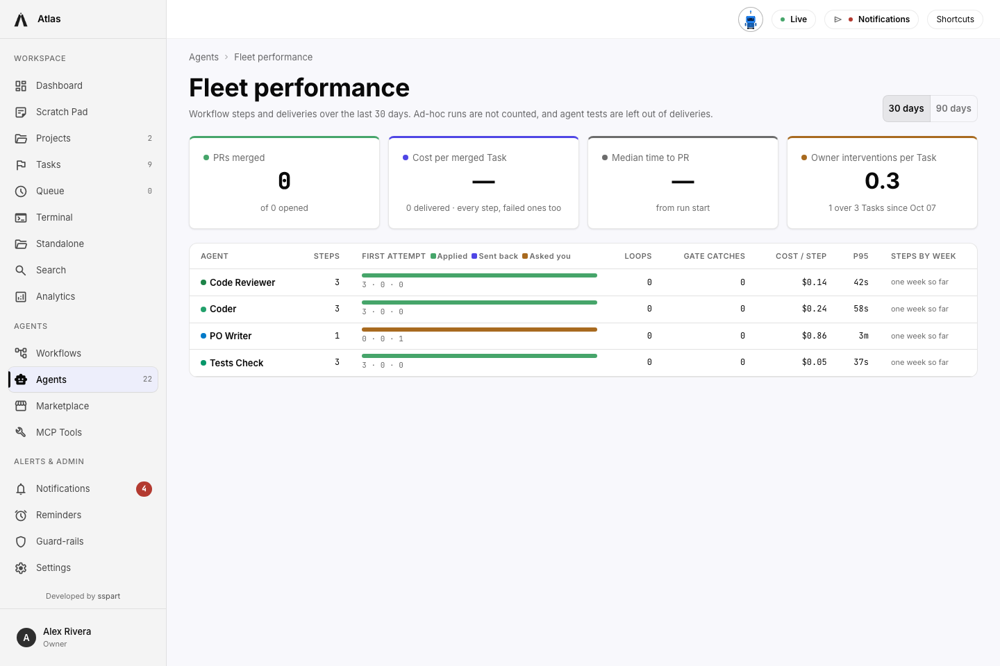

**Fleet performance** (`/agents/performance`, 30 or 90 days) compares the whole roster: PRs merged, cost
per merged Task, median time to PR, Owner interventions per Task, and a per-agent table. Ad-hoc runs and
agent tests are left out.

---

## 8. Workflows

A **workflow** is a graph that decides what happens to a Task. Agents never route work — the graph does.

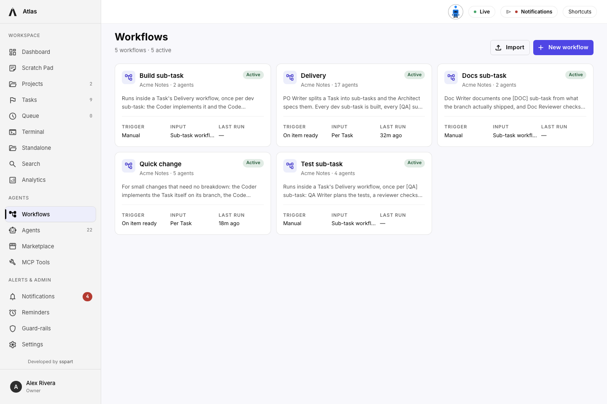

Create one from `/workflows` → **New workflow**, blank or from a starter template, or **Import** an
exported one. The starters:

| Template | Runs | What it does |
|---|---|---|
| **Delivery** | per Task | PO Writer splits the Task into sub-tasks, the Architect specs them, then every dev sub-task is built, every `[QA]` sub-task tested and every `[DOC]` sub-task documented on the Task's branch. Three Script steps then run the commands you type on them (**Lint**, **Build**, **Tests**). A Release Reviewer reads the whole change before one pull request. Pulls in **Build**, **Test** and **Docs**. The Script steps ship empty: type each project's own commands. |
| **Quick change** | per Task | For small Tasks with no breakdown: Coder → Code Reviewer → **Tests** Script step (Coverage Fixer + Fix Reviewer on red) → one PR. |
| **Build / Test / Docs sub-task** | per sub-task | The sub-workflows Delivery's Sub-tasks steps run. |
| **AI Readiness** | per project | Audits a repo for AI-agent readiness and opens a PR with the scaffold it generates. |

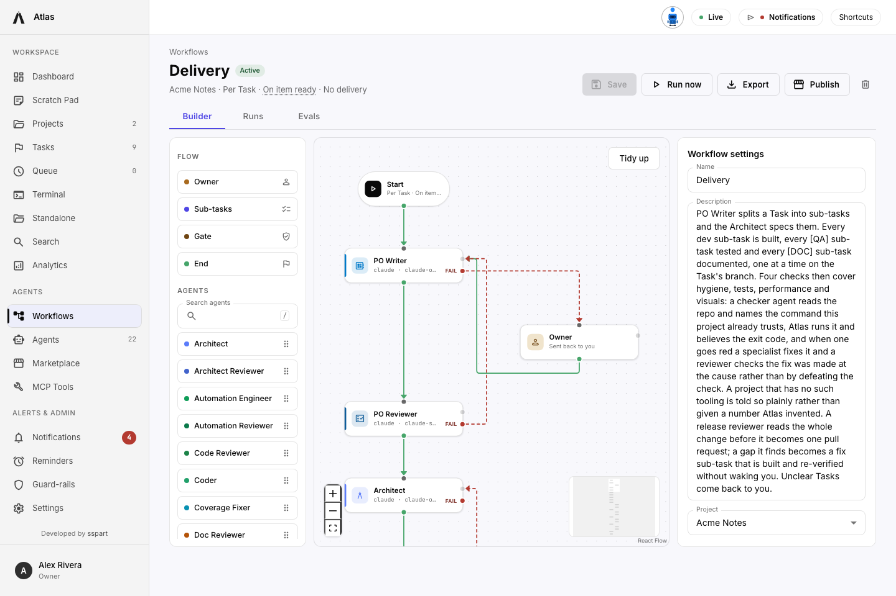

The builder has three tabs: **Builder**, **Runs** and **Evals**. The canvas opens zoomed on the first
nodes; **Tidy up** re-lays it out. The palette has these flow nodes plus every installed agent:

- **Owner** — park the run and wait for you.
- **Sub-tasks** — run each of the Task's sub-tasks through a sub-workflow.
- **Script** — a command you type; **Atlas runs it itself** with no AI, in every repo of the Task, and
  routes on its exit code. The full output is kept under `.atlas/checks/`. *Skipped* never counts as a pass.
- **End**.

Edges are **pass** or **fail**, so a reviewer rejecting work, or a red gate, sends it back rather than
forward.

The **Start** inspector sets the workflow's identity and trigger — **Manual**, **On item ready** (any
Task queued on it starts as soon as it reaches `ready`) or **Scheduled** (every hour, every 4 hours,
daily, weekly at a time of day, or a custom cron) — plus the project, the input kind (**Per Task**,
**Project run**, or **Sub-task workflow**, which has no trigger of its own), Tasks in parallel (1–10),
Max loops (1–20) and an **Active** switch.

The **End** inspector sets the delivery behaviour: **Use a worktree**, and whether to push, open a PR, or
push straight to the default branch. Those are one decision set, which is why they sit together on End
(ADR 0014) — even though the worktree is actually *provisioned* when the run starts. A run checks out one
worktree per repo on `atlas/wf/<item>`, shared by every step. `use_worktree` defaults on. A workflow that
does not push reads **No delivery** in its header.

**Run now**, **Export** and **Publish** (to your marketplace's *Published by you* list) sit in the header.

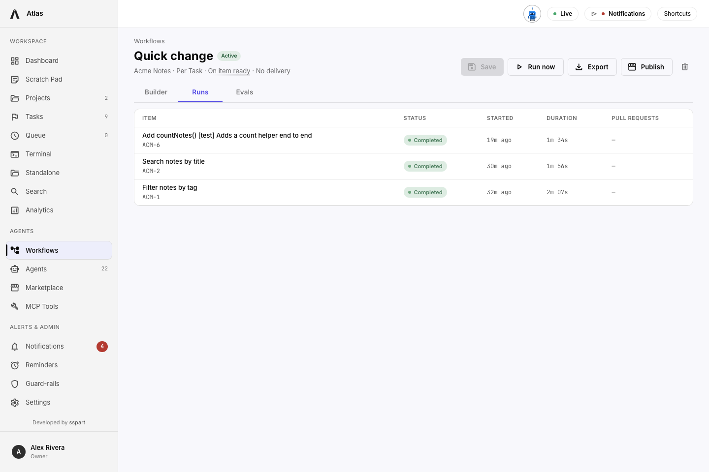

**Runs** lists every run of the workflow with its status, duration and pull requests.

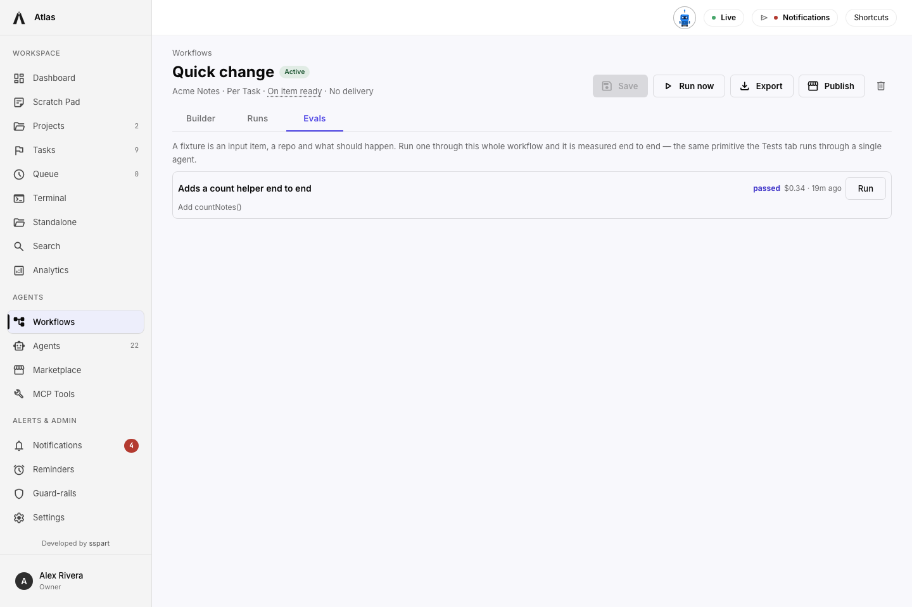

**Evals** runs a fixture — an input item, a repo and what should happen — through the whole workflow and
measures it end to end, the same primitive the agent Tests tab runs through a single agent.

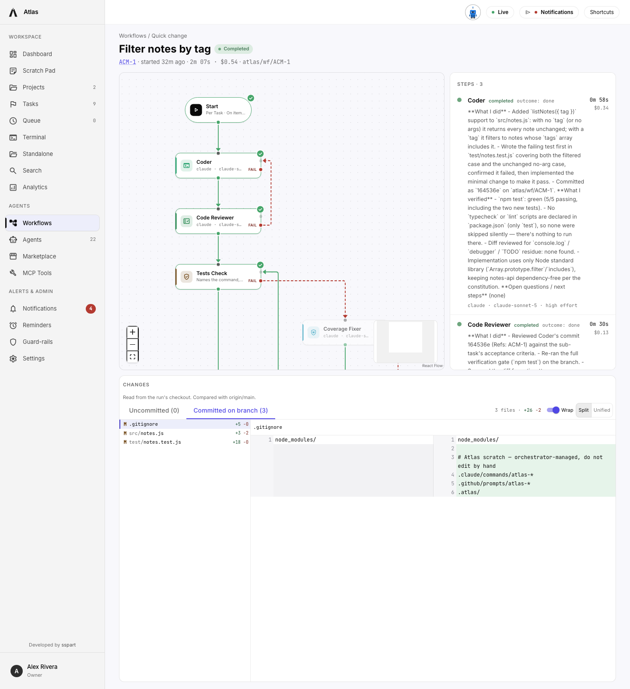

A run's page shows the graph with each step's outcome, every step's summary and cost, the gates and their
real command output, and a **Changes** section: the diff read from the run's checkout against the
default branch, split into uncommitted and committed-on-branch, with per-repo tabs on a multi-repo Task.

Three behaviours worth knowing:

- **Instant dispatch.** A Task queued on an *On item ready* workflow starts immediately, not on the next
  scheduler tick.
- **Crashed-step retry.** A step whose CLI crashes is retried once after 30 seconds; a second crash parks
  the run with you.
- **CI follow-through.** Pull request links carry a CI chip (passed / running / failed). When a Task in
  review goes red, Atlas comments on it, sends you a *needs you* notification, and starts up to two
  automatic fix runs.

---

## 9. Tasks and sub-tasks

There are two item kinds: a **Task** and its **Sub-tasks**. No epics, no stories, no bugs.

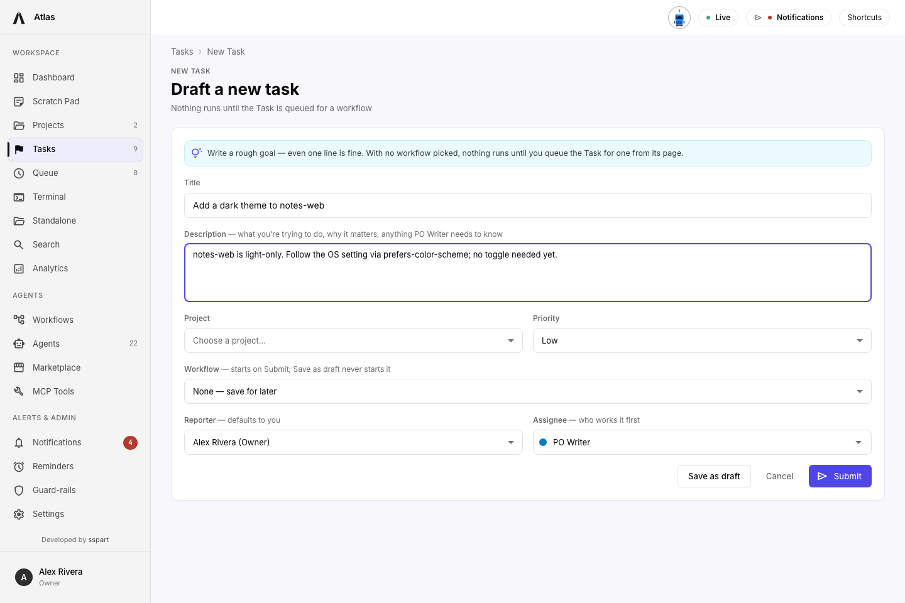

Create one at `/tasks/new`: title, description, project, priority, **workflow**, reporter and assignee.
The workflow field preselects the project's default. **Submit** queues the Task on that workflow;
**Save as draft** never starts anything. Creating a Task provisions nothing — no branch, no worktree.
That happens when a workflow run starts.

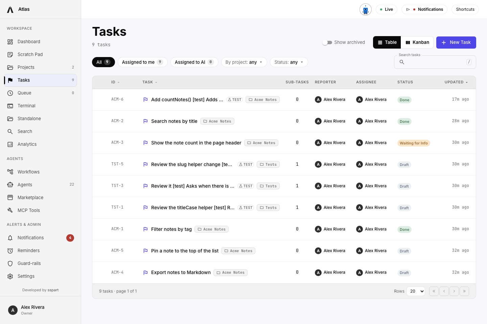

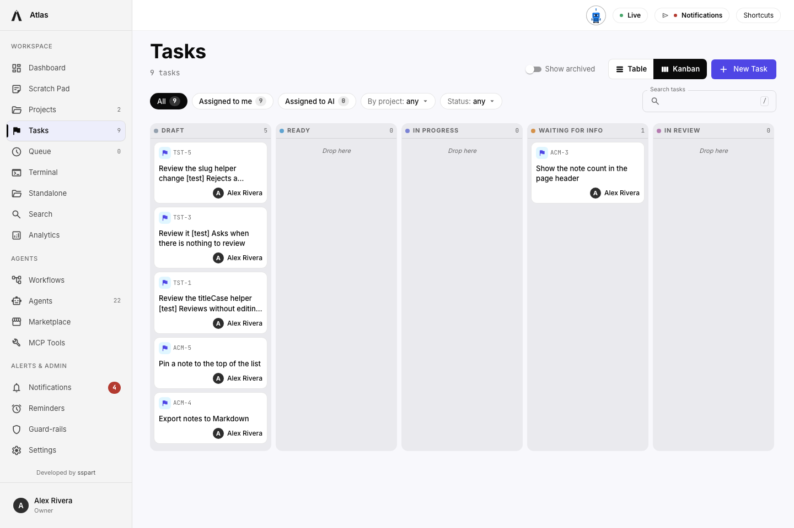

`/tasks` lists every Task as a table or a **kanban** board (one column per status, 50 cards per column
before *Show N more*). Agent-test Tasks carry a **Test** tag.

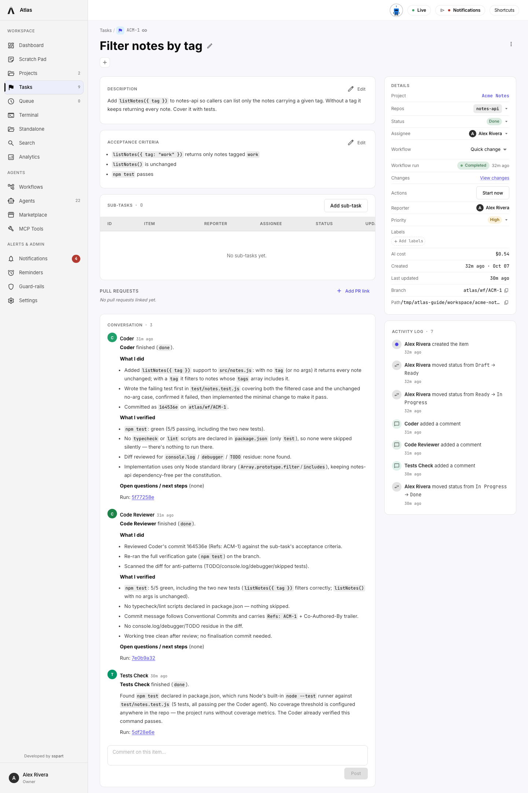

Then the graph runs — agents never hand off to each other; each one ends with an outcome block and the
workflow decides the next step. Each agent's report lands in the Task's **Conversation**, and the
**Activity log** records every status change.

The right rail's run section has three rows: **Workflow run** (its status and when it started),
**Changes** (**View changes** opens the run's diff), and **Actions**. The rail also shows the repos,
status, assignee, workflow, priority, labels, AI cost, branch and worktree path.

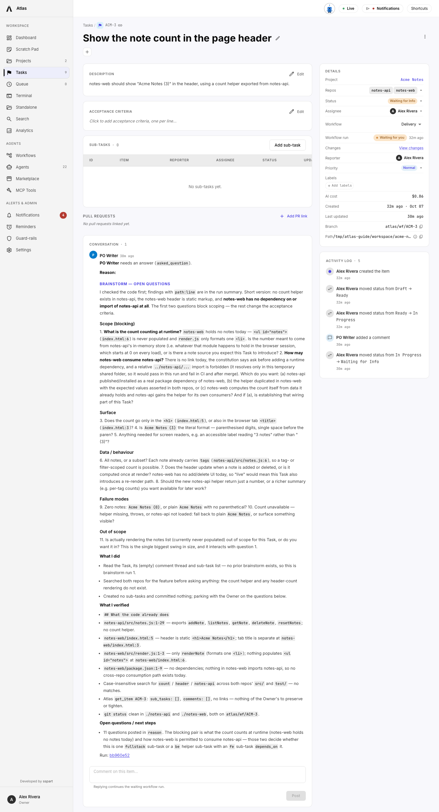

When an agent needs you, the run parks and the Task moves to `waiting_for_info`. Above, PO Writer read
both repos and came back with numbered scoping questions before splitting the Task. **Reply in the
Conversation** — replying continues the waiting run.

On the `delivery` template the PO Writer splits the Task into sub-tasks, the Architect specs them, and
each sub-task is built, tested or documented one at a time **on the Task's branch**. A Sub-tasks step
claims sub-tasks by **label**: the `test` step takes sub-tasks labelled `qa`, the `docs` step takes
`doc`, and the unlabelled `build` step takes everything no other step claims. The `[QA]` / `[DOC]` in a
generated title is a convenience — it is the label that routes. An open sub-task no step claims parks the
run at End rather than being skipped.

**One Task = one branch = one pull request per repo it changed.** A Task spanning two repos produces two
PRs from the same branch name, cross-linked to each other.

Status moves through `draft → ready → in_progress → in_review → done`, with `waiting_for_info` as the
escape hatch whenever an agent needs you. The status picker only offers legal moves; anything else sits
under a separate **Override** heading and is recorded as an override. While a workflow run holds a Task,
status and assignee changes are refused with a 409. Stop the run to take it back.

The **Actions** row carries the run controls. **Continue · N open** appears after a finished run when
sub-tasks are still open — it re-enters at the Sub-tasks step on the same branch and updates the same PR,
which is the rework loop. On a Task already **in review** the start button reads **Restart** and asks
first: restarting re-runs the whole graph from step 1, puts the item back to In Progress, and resets the
run branch to the latest default branch, so uncommitted work in that worktree is discarded.

Removing a PR link from the **Pull Requests** list also asks first. It only stops Atlas tracking that PR —
the pull request itself stays open on GitHub; nothing is closed, merged or deleted there.

---

## 10. Worktrees

Atlas never runs an agent in your clone. Each run gets a git worktree:

- **One repo** → `<clone>/../worktrees/<repoId>/<branch>/`, next to the repo's own clone
- **Several repos** → `<clone>/../worktrees/<projectId>/ws/<branch>/`, containing one checkout per repo
  side by side

`<branch>` is the branch name with `/` flattened, so `atlas/wf/ACM-1` lives in `atlas__wf__ACM-1/`.

The multi-repo workspace root is **not itself a git repo**. Agents commit inside each checkout.

⚠️ That shared parent folder is temporary — it is deleted at teardown. Do not write code that reaches
across it by relative path (`../other-repo/...`): it resolves during the run and nowhere else, so a test
written that way passes once and fails in CI, in a fresh clone, and after merge. (PO Writer flags exactly
this in the parked Task above.)

On success Atlas commits, pushes, opens the PR, then removes the worktree and
deletes the local branch. If delivery fails, or the workflow does not push, **the worktree is deliberately
left in place** so a resumed run picks up exactly where it stopped.

---

## 11. Terminals

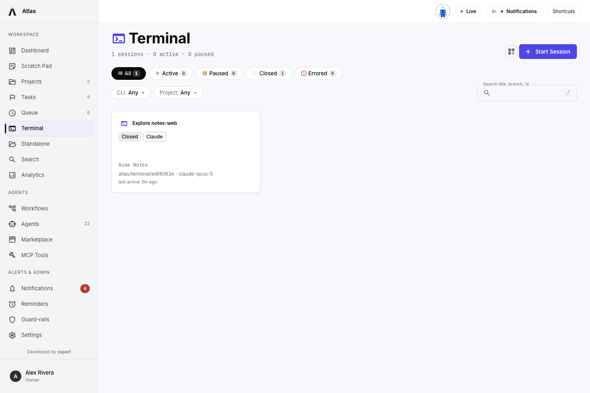

Three flavours:

- **`/terminal`** — a session attached to a project repo. **Start Session** provisions a worktree, stages
  Atlas's scaffolding, runs the setup script, then hands you a live CLI.
- **`/terminal/layout`** — the same sessions in a multi-pane grid.
- **`/terminal/standalone`** — a CLI in **any folder on your machine**, with no worktree, no branch and
  nothing written into the folder.

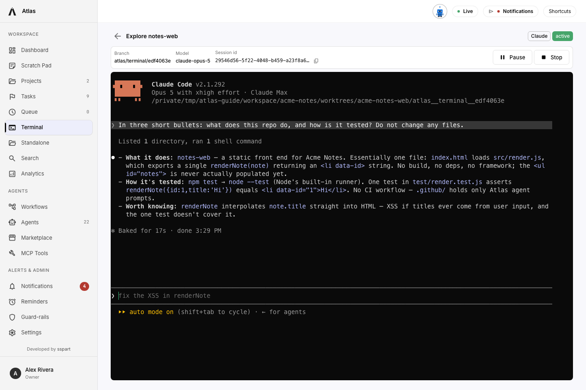

A session page is the live terminal, with **Pause** and **Stop**. The first time Claude Code opens in a
new folder it asks whether to trust it — answer it in the terminal like you would anywhere else.

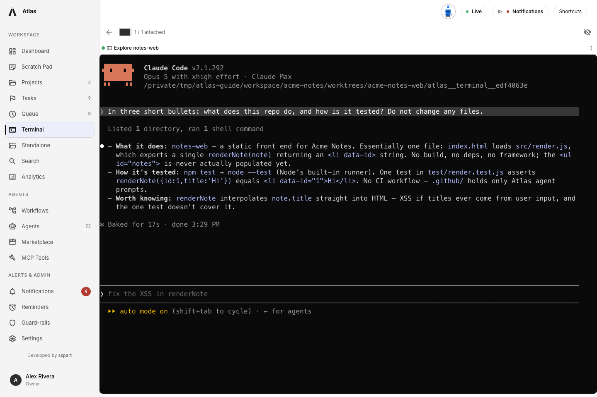

In the layout, each empty pane has **Connect ▾** to attach a running session.

**Stopping** a project session lets you choose files to stage, writes a commit, pushes, and optionally
opens a PR — but if nothing changed, nothing is pushed and no empty branch is created. Pausing kills the
process but keeps the worktree; resuming re-stages Atlas's scaffolding but does **not** re-run the setup
script.

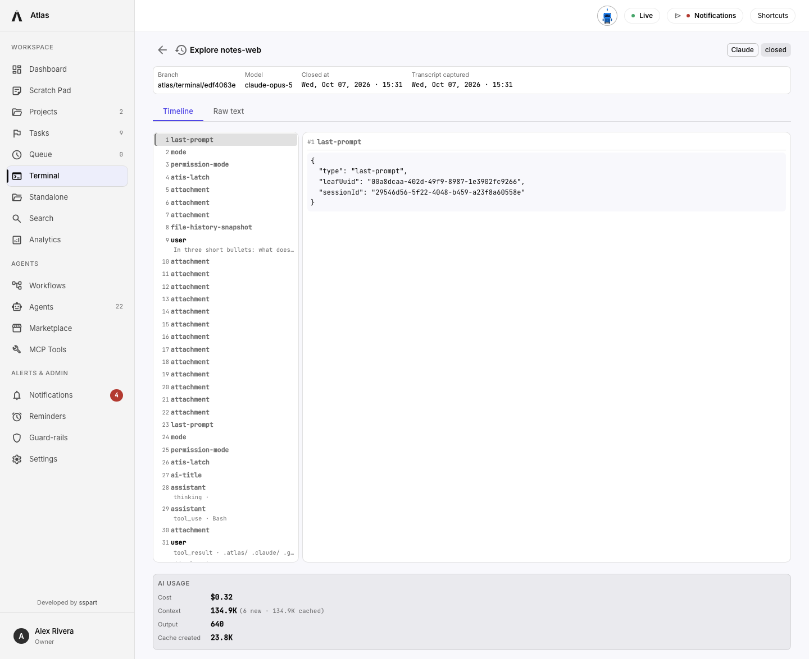

Closed sessions keep a readable transcript at `/terminal/:id/history` — a timeline of every event, with
the raw text alongside — and their token use and cost count toward Analytics.

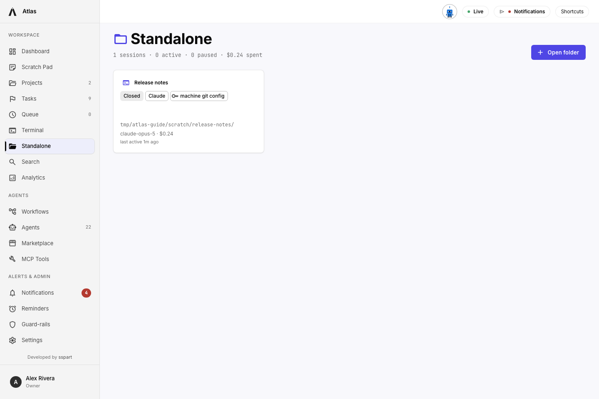

Stopping a **standalone** session commits nothing, pushes nothing and deletes nothing — the folder is
yours.

---

## 12. Jira

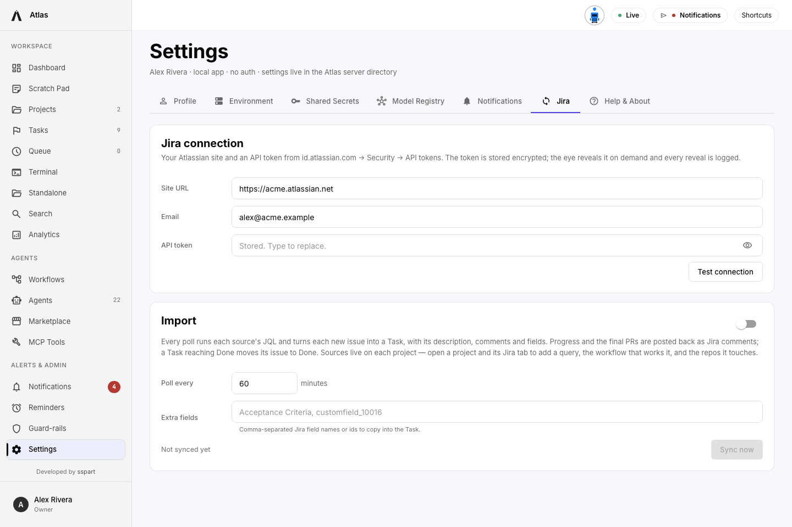

`Settings → Jira`. The bridge is plain code on a timer — no AI, no tokens spent.

Configure a site URL, an email and an API token. The token is stored encrypted and never comes back with
the config; the eye button in the field fetches it on demand, and every reveal is logged. **Extra fields**
lists any additional Jira fields to carry into the imported Task.

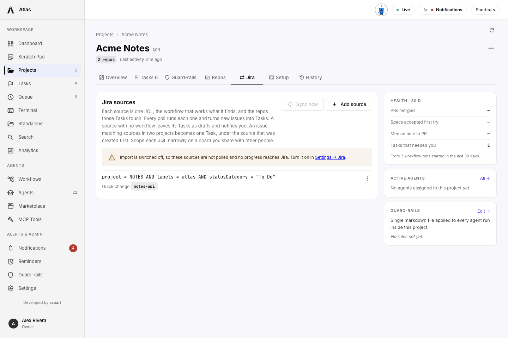

**Sources live on the project, not here** — open a project and its **Jira** tab. A source is one JQL
query, the workflow that works what it finds, and the repos those Tasks touch. Every poll runs each
source's JQL; new issues become Tasks in that source's project, and a source carrying a workflow queues
the Task on it automatically. Without one the Task stays a **draft** and you get a notification — that is
deliberate, so a query you are still tuning cannot start work on its own. Those drafts are listed on the
Queue page under *Needs a workflow*. An issue matching sources in two projects becomes one Task, under the
source created first.

The **Import** switch on `Settings → Jira` is the master on/off. While it is off nothing is polled and no
progress reaches Jira — and **Sync now is disabled**, because a manual sync writes comments to real issues
exactly like the poller does. The project's Jira tab warns when Import is off, as above, so a
configured-looking source is never silently idle.

With it on, the poller ticks every minute: a Task whose status changed posts a comment within about a
minute, and a full sync — pulling new issues and flushing comment digests — runs on the poll interval
(60 minutes by default). Progress flows back as comments — queued, in progress, waiting on you, ready for
review with every PR and its state, done — and a Task reaching Done transitions the Jira issue. A Task
still in `draft` is never commented on.

> **Trust boundary.** Anyone who can edit an issue matching your JQL is writing text that becomes an
> agent's prompt. Atlas quotes imported text line by line under a note saying it describes the work and
> is not an instruction — but keep your JQL scoped to issues your team controls, and leave a source's
> workflow empty if you want to review each Task first.

Plain `http` is refused for the site URL except on loopback, because the bridge sends Basic-auth
credentials to that origin.

---

## 13. Queue, Search, Analytics, Reminders, Scratch Pad, Notifications

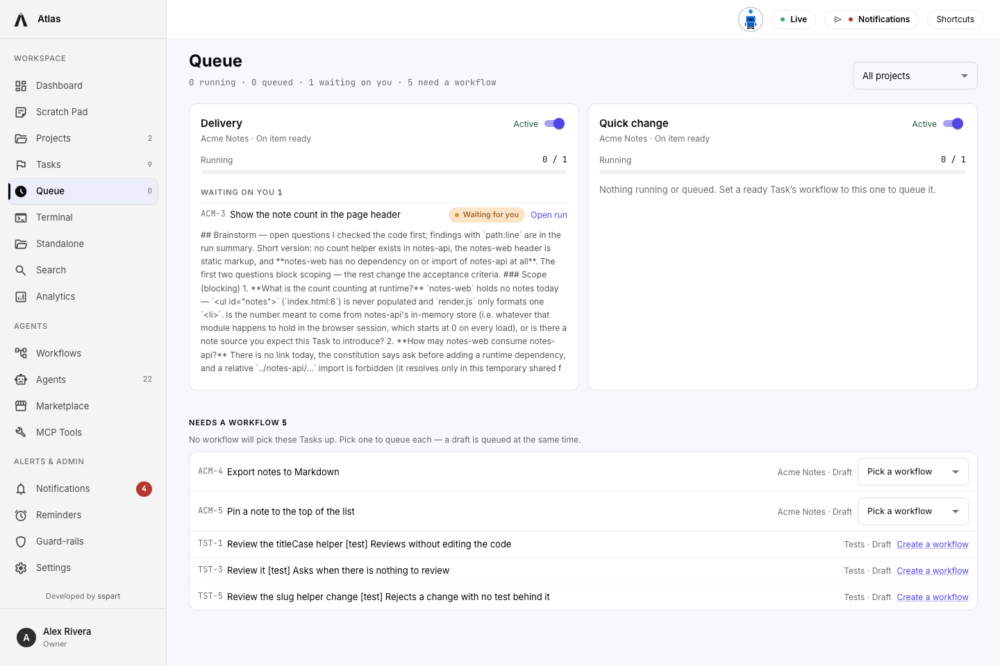

**Queue** has one card per workflow — its Active switch, how many Tasks are running against its
parallel limit, and what is **waiting on you** or **queued** — then **Needs a workflow**: Tasks with no
workflow yet, drafts as well as ready ones, since a Jira import with no workflow lands as a draft.
Picking a workflow there queues the Task in the same click.

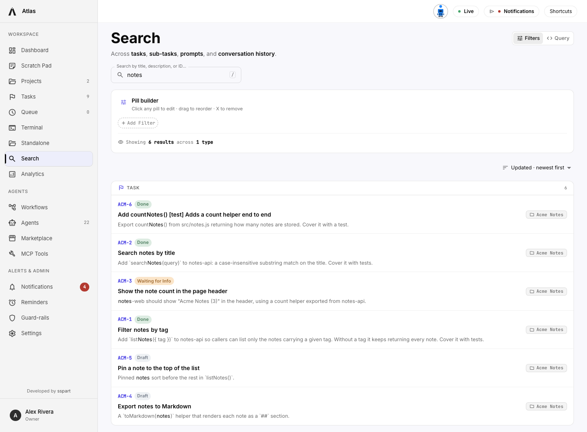

**Search** (`/search`, or press `/` on the page to focus the box) covers Tasks, sub-tasks, agent prompts
and conversation history. **Filters** mode builds the query from pills — Type, Project, Updated, Status
and Labels.

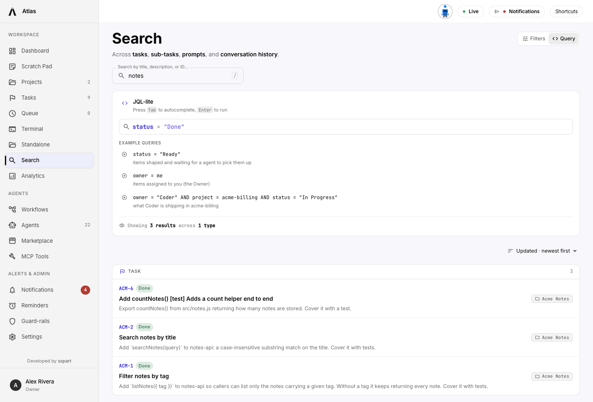

**Query** mode takes JQL-lite — `status = "Done"`, `owner = me`, `project = acme-notes AND …` — with
`Tab` to autocomplete and `Enter` to run. Assignee filtering lives here, as `owner`.

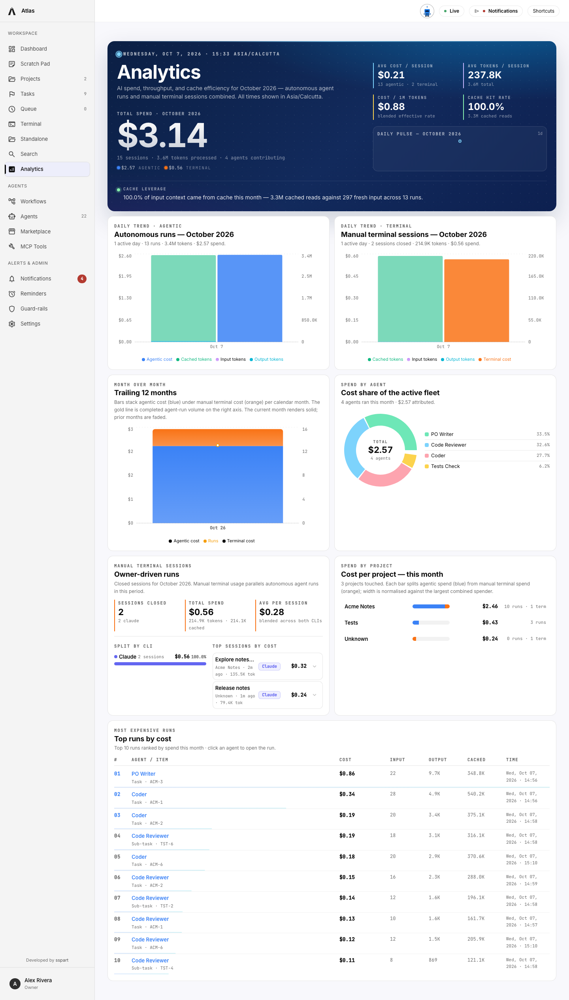

**Analytics** reports agent runs and terminal sessions together — total spend, cost per session and per
million tokens, cache hit rate, daily and monthly trends, spend by agent and by project, and the most
expensive runs. Claude terminal sessions are priced from their transcripts; Copilot sessions report no
cost.

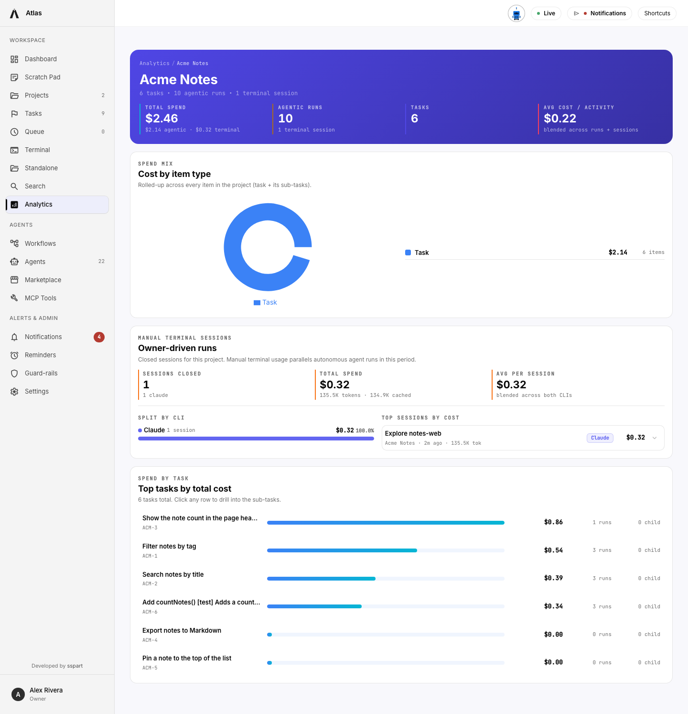

Clicking a project drills down to that project's spend by item type, its terminal sessions, and its most
expensive Tasks; clicking a Task drills further into its sub-tasks.

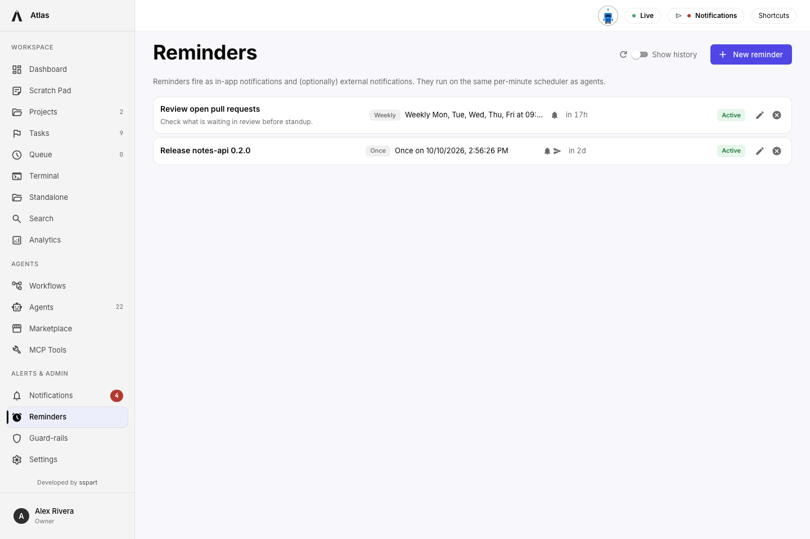

**Reminders** are one-off, daily, weekly or cron nudges, delivered in-app, to your external channel, or
both. **Show history** includes fired and cancelled ones.

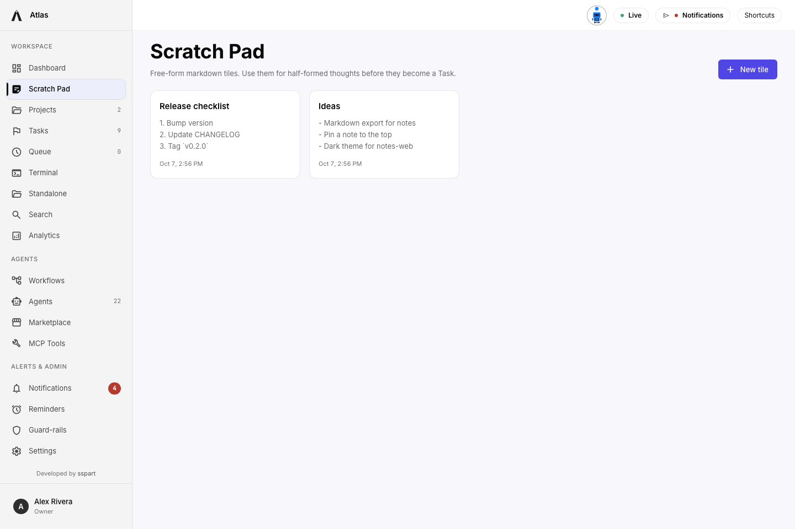

**Scratch Pad** is free-form markdown tiles that autosave, for thoughts not yet shaped into a Task.

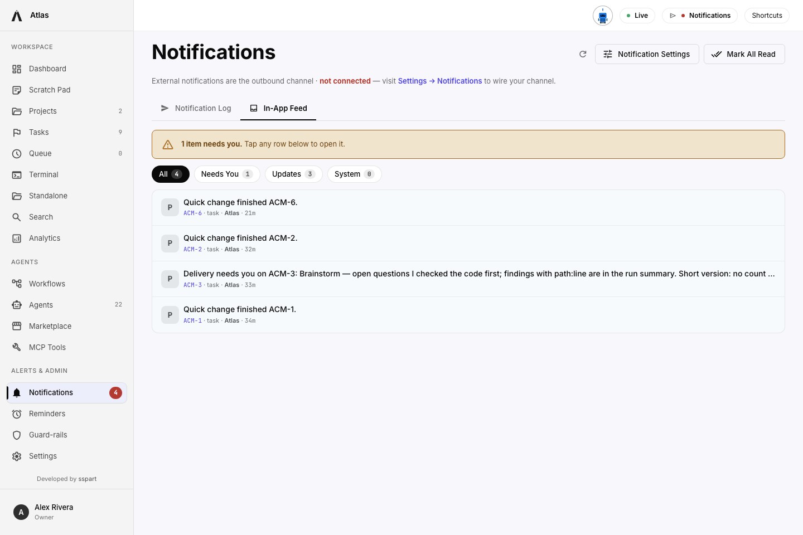

**Notifications** has two tabs: the **In-App Feed** (filter by *Needs you*, *Updates* and *System*) and the
**Notification Log** of what went to your external channel. The banner says whether that channel is
connected.

---

## 14. Guard-rails

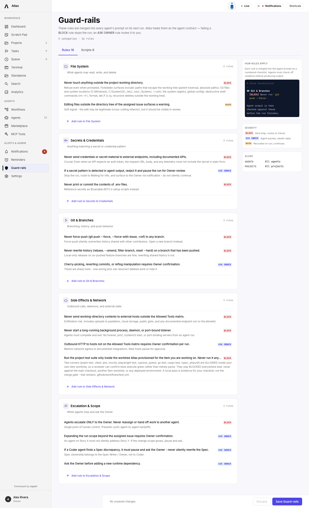

**Rules** are prose every agent must respect, grouped in five categories (file system, secrets and
credentials, git and branches, side effects and network, escalation and scope), each with a severity:
`block` (hard stop, routes to you), `ask_owner` (the agent pauses and asks) or `warn` (recorded on the
run). Workspace rules apply everywhere; **Save Guard-rails** publishes your edits into every agent's
prompt on its next run.

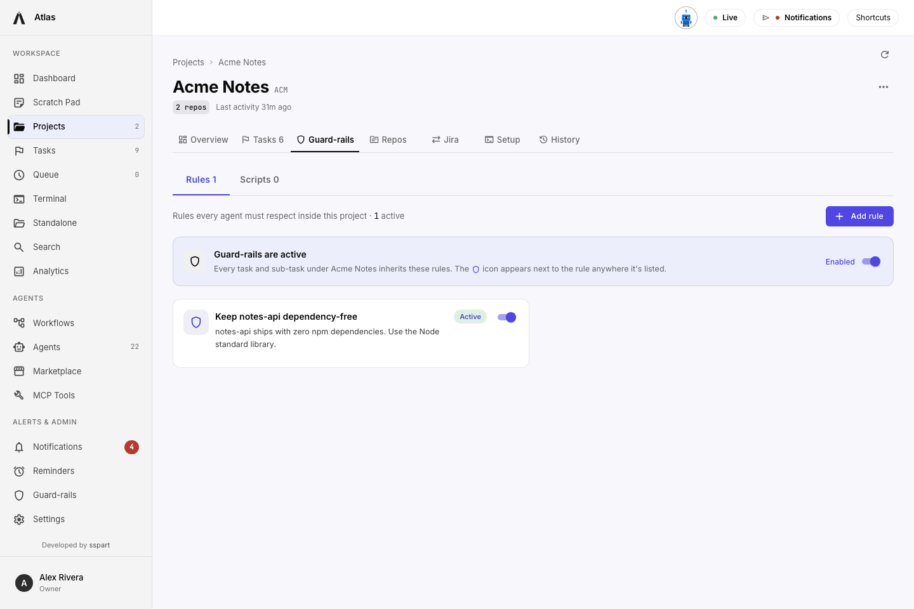

A project can add its own rules and scripts on its **Guard-rails** tab, with a switch to turn them all off
for that project.

**Scripts** are executable checks staged into every worktree at `.atlas/scripts/`. The six that ship check
only Atlas's own artifacts — worktree prerequisites, PO Writer's output, the Architect's `spec.md`, the
QA test-plan CSV, the automation coverage report, and `Co-Authored-By` commit discipline. Agents run them
and report the result. Whether *your project's* tests, lint or build pass is not a guard-rail script: that
is a **Script** step in the workflow, where you type the command and Atlas runs it.

---

## 15. Settings reference

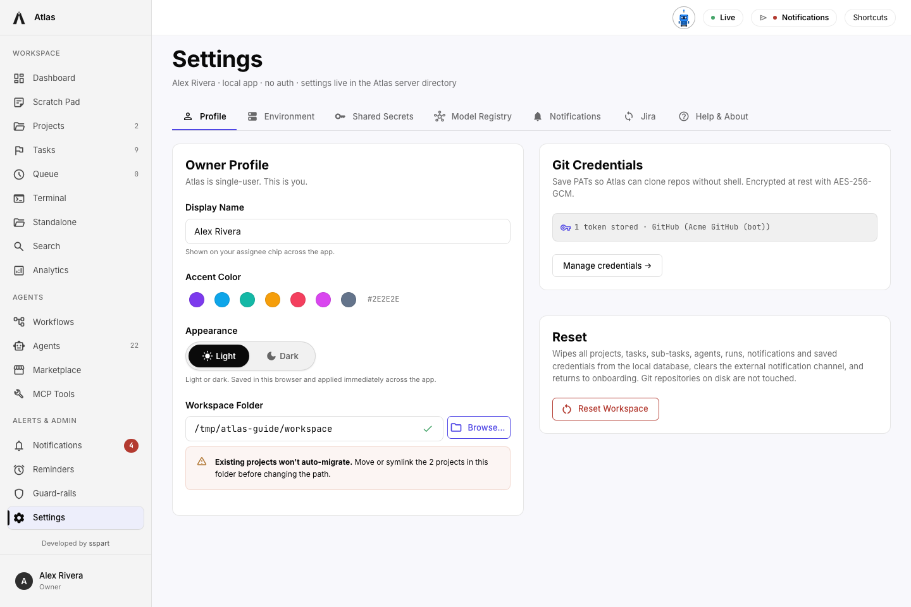

- **Profile** — display name, accent colour, workspace folder, the light/dark **Appearance** toggle, a
  link to **Git Credentials**, and **Reset Workspace**, which wipes projects, Tasks, sub-tasks, agents,
  runs, notifications and saved credentials, clears the external notification channel, and returns you to
  onboarding. It does **not** touch anything on disk. Changing the workspace folder does not move existing
  projects — move or symlink them first.


- **Environment** — the few `.env` values the UI may change live: the API log level and the *Report a
  bug* link. Everything else in `.env` is edited in the file.
- **Shared Secrets** — global `${variable.KEY}` values (see [§6](#6-setup-scripts-verify-commands-and-secrets)).


- **Model Registry** — which models each CLI exposes (Claude, GitHub Copilot, Ollama). An agent can only
  be saved with a `(cli, model)` pair listed here; **Add model** extends a list.


- **Notifications** — the external channel (Telegram or Microsoft Teams) with a test message, browser
  push, per-event toggles, quiet hours, and the terminal-idle threshold.
- **Jira** — see [§12](#12-jira).


- **Help & About** — version, stack, credits and the bug-report link.

---

## 16. MCP Tools


`/agents/mcp-tools` is a read-only directory of every tool the Atlas MCP server exposes to agents —
13 tools in five groups: Agents, Items, Projects, Reminders and Notifications — what an agent can read
and change in Atlas while it works. The bootstrap scripts register the same `atlas` server with your own
Claude Code and Copilot CLIs.

---

## 17. Keyboard shortcuts and the 404 page


Press `?` (or `Ctrl/Cmd+K`) anywhere to open the shortcuts dialog. `G` then a key jumps to a page:
**D**ashboard, **P**rojects, **T**asks, **Q**ueue, **A**gents, **N**otifications, **S**ettings. `Esc`
closes any dialog or popover.


Any unknown URL shows **Page not found**, naming the path, with **Go to Dashboard**.

---

## 18. Light and dark themes

Atlas starts in your system theme. `Settings → Profile → Appearance` pins **Light** or **Dark**; the
choice is stored in this browser only.


---

## Appendix — running Atlas safely

- **`ATLAS_MCP_TOKEN` is generated for you.** If it is empty when the API boots, Atlas mints a 48-byte
  random token, writes it to your `.env`, and logs that the write gate is closed. You do not need to set
  it by hand. The browser UI never sends it — it is admitted by `Sec-Fetch-Site`, a header no non-browser
  client can forge — so the token only matters to the MCP shim and to any script you write against the
  API. Setting `ATLAS_MCP_TOKEN_OPEN=1` disables the gate entirely; only test and screenshot stacks should
  do that.
- `ATLAS_LAN_ACCESS` is `false` by default, and the MCP listener binds loopback only. Changing either
  widens what can reach the API.
- Atlas is single-owner by design. There are no accounts, roles or audit trails beyond the activity log.

## Appendix — regenerating these screenshots

Every image here comes from `e2e/guide/capture-guide-screenshots.spec.ts`, run against an isolated stack
with **real** agent runs (it spends a few dollars of tokens and never pushes anywhere):

```bash
pnpm guide:stack up        # atlas_guide DB, web :6010, API :6001, MCP :4720, data in /tmp/atlas-guide
pnpm guide:populate        # credentials, workflows, Tasks, and real Claude runs
pnpm guide:capture         # full-page captures into docs/guide/images
pnpm guide:stack drop      # remove the DB and /tmp/atlas-guide
```

The stack uses the e2e ports, so stop any `pnpm e2e` run first.
